# 🌍 SkyLog — Global Weather Dashboard

### Monitoramento climático em tempo real de 12 cidades ao redor do mundo

---

### Sync Ativo • Última atualização: 05:19 (BRT)
*Projeto em expansão, operando com automações no GitHub Actions para manter métricas globais atualizadas em tempo real. Consulte a aba superior para a versão Web.*

 

## 🏙️ São Paulo, Brasil

<table>
  <tr>
    <td align="center" width="50%">
      
    </td>
    <td align="center" width="50%">
      
    </td>
  </tr>
</table>

| Parâmetro | Medição em Tempo Real |
|:---:|:---:|
| **Temperatura** | 14.7°C (Sensação: 15.5°C) |
| **Variação (Mín/Máx)** | 14.6°C — 23.2°C |
| **Umidade** | 96% |
| **Vento** | 3.9 km/h |
| **Condição Atual** | Nublado |
| **Horário Local** | 05:19 |

 
 

## 🏙️ Rio de Janeiro, Brasil

<table>
  <tr>
    <td align="center" width="50%">
      
    </td>
    <td align="center" width="50%">
      
    </td>
  </tr>
</table>

| Parâmetro | Medição em Tempo Real |
|:---:|:---:|
| **Temperatura** | 21.6°C (Sensação: 24.7°C) |
| **Variação (Mín/Máx)** | 21.6°C — 23.2°C |
| **Umidade** | 96% |
| **Vento** | 8.5 km/h |
| **Condição Atual** | Nublado |
| **Horário Local** | 05:19 |

 
 

## 🏙️ Buenos Aires, Argentina

<table>
  <tr>
    <td align="center" width="50%">
      
    </td>
    <td align="center" width="50%">
      
    </td>
  </tr>
</table>

| Parâmetro | Medição em Tempo Real |
|:---:|:---:|
| **Temperatura** | 12.9°C (Sensação: 12.5°C) |
| **Variação (Mín/Máx)** | 11.9°C — 17.0°C |
| **Umidade** | 90% |
| **Vento** | 5.9 km/h |
| **Condição Atual** | Nublado |
| **Horário Local** | 05:19 |

 
 

## 🏙️ Mexico City, México

<table>
  <tr>
    <td align="center" width="50%">
      
    </td>
    <td align="center" width="50%">
      
    </td>
  </tr>
</table>

| Parâmetro | Medição em Tempo Real |
|:---:|:---:|
| **Temperatura** | 16.1°C (Sensação: 15.6°C) |
| **Variação (Mín/Máx)** | 13.9°C — 25.5°C |
| **Umidade** | 72% |
| **Vento** | 5.9 km/h |
| **Condição Atual** | Parcialmente nublado |
| **Horário Local** | 02:19 |

 
 

## 🏙️ New York, EUA

<table>
  <tr>
    <td align="center" width="50%">
      
    </td>
    <td align="center" width="50%">
      
    </td>
  </tr>
</table>

| Parâmetro | Medição em Tempo Real |
|:---:|:---:|
| **Temperatura** | 13.0°C (Sensação: 13.9°C) |
| **Variação (Mín/Máx)** | 12.8°C — 22.3°C |
| **Umidade** | 99% |
| **Vento** | 0.5 km/h |
| **Condição Atual** | Neblina |
| **Horário Local** | 04:19 |

 
 

## 🏙️ San Francisco, EUA

<table>
  <tr>
    <td align="center" width="50%">
      
    </td>
    <td align="center" width="50%">
      
    </td>
  </tr>
</table>

| Parâmetro | Medição em Tempo Real |
|:---:|:---:|
| **Temperatura** | 12.1°C (Sensação: 10.4°C) |
| **Variação (Mín/Máx)** | 11.5°C — 16.2°C |
| **Umidade** | 93% |
| **Vento** | 13.8 km/h |
| **Condição Atual** | Nublado |
| **Horário Local** | 01:19 |

 
 

## 🏙️ London, Reino Unido

<table>
  <tr>
    <td align="center" width="50%">
      
    </td>
    <td align="center" width="50%">
      
    </td>
  </tr>
</table>

| Parâmetro | Medição em Tempo Real |
|:---:|:---:|
| **Temperatura** | 24.2°C (Sensação: 25.0°C) |
| **Variação (Mín/Máx)** | 20.3°C — 34.2°C |
| **Umidade** | 55% |
| **Vento** | 5.8 km/h |
| **Condição Atual** | Céu limpo |
| **Horário Local** | 09:19 |

 
 

## 🏙️ Paris, França

<table>
  <tr>
    <td align="center" width="50%">
      
    </td>
    <td align="center" width="50%">
      
    </td>
  </tr>
</table>

| Parâmetro | Medição em Tempo Real |
|:---:|:---:|
| **Temperatura** | 25.6°C (Sensação: 26.9°C) |
| **Variação (Mín/Máx)** | 20.5°C — 32.8°C |
| **Umidade** | 57% |
| **Vento** | 7.2 km/h |
| **Condição Atual** | Principalmente limpo |
| **Horário Local** | 10:19 |

 
 

## 🏙️ Tokyo, Japão

<table>
  <tr>
    <td align="center" width="50%">
      
    </td>
    <td align="center" width="50%">
      
    </td>
  </tr>
</table>

| Parâmetro | Medição em Tempo Real |
|:---:|:---:|
| **Temperatura** | 23.5°C (Sensação: 25.0°C) |
| **Variação (Mín/Máx)** | 15.7°C — 25.3°C |
| **Umidade** | 66% |
| **Vento** | 5.9 km/h |
| **Condição Atual** | Céu limpo |
| **Horário Local** | 17:19 |

 
 

## 🏙️ Dubai, Emirados Árabes

<table>
  <tr>
    <td align="center" width="50%">
      
    </td>
    <td align="center" width="50%">
      
    </td>
  </tr>
</table>

| Parâmetro | Medição em Tempo Real |
|:---:|:---:|
| **Temperatura** | 37.8°C (Sensação: 42.6°C) |
| **Variação (Mín/Máx)** | 25.4°C — 38.4°C |
| **Umidade** | 36% |
| **Vento** | 11.2 km/h |
| **Condição Atual** | Céu limpo |
| **Horário Local** | 12:19 |

 
 

## 🏙️ Cairo, Egito

<table>
  <tr>
    <td align="center" width="50%">
      
    </td>
    <td align="center" width="50%">
      
    </td>
  </tr>
</table>

| Parâmetro | Medição em Tempo Real |
|:---:|:---:|
| **Temperatura** | 25.5°C (Sensação: 27.7°C) |
| **Variação (Mín/Máx)** | 18.0°C — 30.3°C |
| **Umidade** | 48% |
| **Vento** | 7.7 km/h |
| **Condição Atual** | Principalmente limpo |
| **Horário Local** | 11:19 |

 
 

## 🏙️ Sydney, Austrália

<table>
  <tr>
    <td align="center" width="50%">
      
    </td>
    <td align="center" width="50%">
      
    </td>
  </tr>
</table>

| Parâmetro | Medição em Tempo Real |
|:---:|:---:|
| **Temperatura** | 17.6°C (Sensação: 19.4°C) |
| **Variação (Mín/Máx)** | 14.7°C — 19.8°C |
| **Umidade** | 94% |
| **Vento** | 3.5 km/h |
| **Condição Atual** | Principalmente limpo |
| **Horário Local** | 18:19 |

 
 

 

    <i>🚀 Novas cidades da Ásia e Europa estão planejadas para as próximas atualizações. Fique ligado!</i>

## 📊 Histórico de Dados

| Estatística | Valor |
|:---:|:---:|
| **Total de registros** | 672 |
| **Primeiro registro** | `2026-05-17 19:38` |
| **Último registro** | `2026-05-25 18:19` |
| **Temperatura mais alta** | **38.0°C** — Dubai |
| **Temperatura mais baixa** | **5.7°C** — Buenos Aires |

📂 <a href="data/history.csv">Ver histórico completo (history.csv)</a>

---

### ⚙️ Informações Técnicas

| Item | Detalhe |
|:---:|:---:|
| **Fonte de dados** | <a href="https://open-meteo.com/">Open-Meteo API</a> (gratuita) |
| **Frequência** | 12× ao dia (a cada 2 horas dia e noite) |
| **Automação** | GitHub Actions — <a href=".github/workflows/weather.yml">ver workflow</a> |
| **Script** | `update_weather.py` (requests e pytz) |
| **Cidades Monitoradas** | 12 cidades globais |

---

**Feito com 💙 por [Pedroxious](https://github.com/Pedroxious) · Dados: [Open-Meteo](https://open-meteo.com/)**

