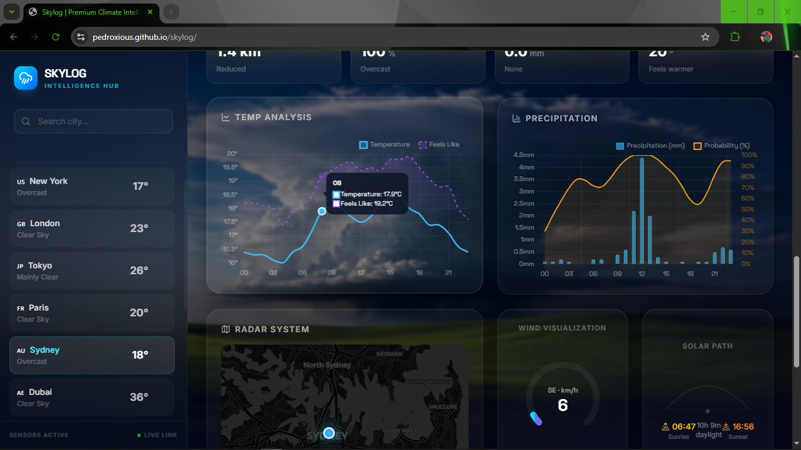
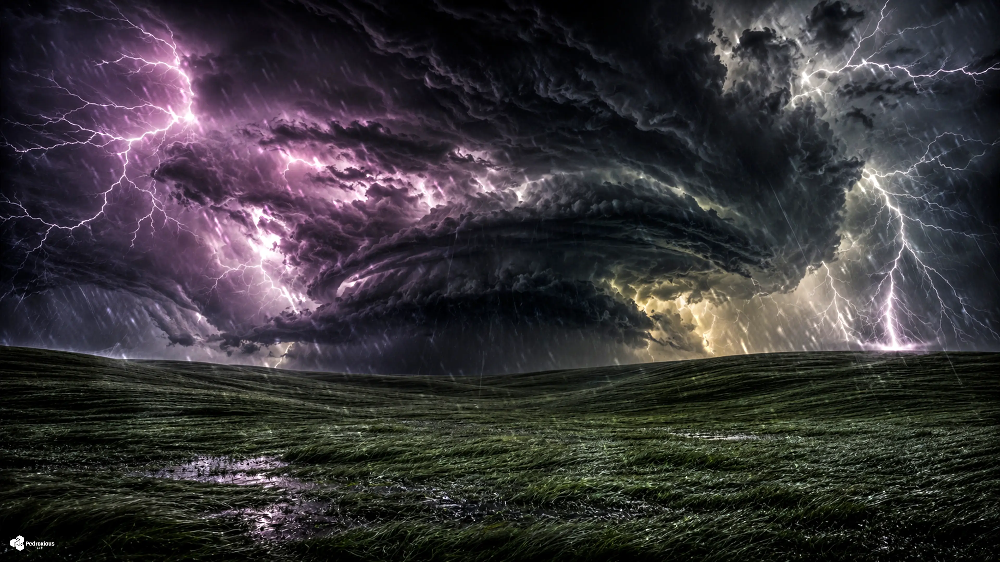

# SkyLog — Global Weather Dashboard

### Monitoramento climático em tempo real de 15 cidades ao redor do mundo

---

### Sync Ativo • Última atualização: 20:59 (BRT)
*Projeto em expansão, operando com automações no GitHub Actions para manter métricas globais atualizadas em tempo real. Consulte o link superior para a versão Web.*

 

## São Paulo, Brasil

<table>
  <tr>
    <td align="center" width="50%">
      
    </td>
    <td align="center" width="50%">
      
    </td>
  </tr>
</table>

| Parâmetro | Medição em Tempo Real |
|:---:|:---:|
| Temperatura | 19.4°C (Sensação: 19.8°C) |
| Variação Diária | 15.9°C — 25.6°C |
| Umidade / Pressão | 76% / 1018.2 hPa |
| Vento / Direção | 8.4 km/h (Direção: 350°) |
| UV / Visibilidade | 0.0 / 30.7 km |
| Condição Atual | Principalmente limpo |
| Horário Local | 20:59 |

### Previsão para os Próximos Dias

| Dia | Condição | Temperatura | Índice UV Máximo | Precipitação Prevista |
|:---:|:---:|:---:|:---:|:---:|
| Hoje | ☁️ Nublado | 15.9°C a 25.6°C | UV: 5 | Precip: 0.0 mm |
| Amanhã | ☀️ Céu limpo | 16.2°C a 26.0°C | UV: 5 | Precip: 0.0 mm |
| 02/07 | ☀️ Céu limpo | 16.4°C a 25.6°C | UV: 5 | Precip: 0.0 mm |

 
 

## Rio de Janeiro, Brasil

<table>
  <tr>
    <td align="center" width="50%">
      
    </td>
    <td align="center" width="50%">
      
    </td>
  </tr>
</table>

| Parâmetro | Medição em Tempo Real |
|:---:|:---:|
| Temperatura | 22.6°C (Sensação: 25.1°C) |
| Variação Diária | 19.3°C — 24.6°C |
| Umidade / Pressão | 88% / 1017.0 hPa |
| Vento / Direção | 10.9 km/h (Direção: 27°) |
| UV / Visibilidade | 0.0 / 11.5 km |
| Condição Atual | Céu limpo |
| Horário Local | 20:59 |

### Previsão para os Próximos Dias

| Dia | Condição | Temperatura | Índice UV Máximo | Precipitação Prevista |
|:---:|:---:|:---:|:---:|:---:|
| Hoje | ☁️ Nublado | 19.3°C a 24.6°C | UV: 5 | Precip: 0.0 mm |
| Amanhã | ⛅ Parcialmente nublado | 20.9°C a 28.5°C | UV: 5 | Precip: 0.0 mm |
| 02/07 | ☁️ Nublado | 20.2°C a 27.2°C | UV: 5 | Precip: 0.0 mm |

 
 

## Buenos Aires, Argentina

<table>
  <tr>
    <td align="center" width="50%">
      
    </td>
    <td align="center" width="50%">
      
    </td>
  </tr>
</table>

| Parâmetro | Medição em Tempo Real |
|:---:|:---:|
| Temperatura | 9.6°C (Sensação: 7.7°C) |
| Variação Diária | 5.3°C — 12.2°C |
| Umidade / Pressão | 82% / 1017.6 hPa |
| Vento / Direção | 7.6 km/h (Direção: 94°) |
| UV / Visibilidade | 0.0 / 44.5 km |
| Condição Atual | Céu limpo |
| Horário Local | 20:59 |

### Previsão para os Próximos Dias

| Dia | Condição | Temperatura | Índice UV Máximo | Precipitação Prevista |
|:---:|:---:|:---:|:---:|:---:|
| Hoje | ☀️ Céu limpo | 5.3°C a 12.2°C | UV: 3 | Precip: 0.0 mm |
| Amanhã | ☁️ Nublado | 4.0°C a 12.6°C | UV: 3 | Precip: 0.0 mm |
| 02/07 | 🌤️ Principalmente limpo | 1.8°C a 8.1°C | UV: 3 | Precip: 0.0 mm |

 
 

## Mexico City, México

<table>
  <tr>
    <td align="center" width="50%">
      
    </td>
    <td align="center" width="50%">
      
    </td>
  </tr>
</table>

| Parâmetro | Medição em Tempo Real |
|:---:|:---:|
| Temperatura | 17.6°C (Sensação: 18.3°C) |
| Variação Diária | 13.7°C — 21.5°C |
| Umidade / Pressão | 75% / 1016.2 hPa |
| Vento / Direção | 1.5 km/h (Direção: 166°) |
| UV / Visibilidade | 0.8 / 8.1 km |
| Condição Atual | Chuvisco |
| Horário Local | 17:59 |

### Previsão para os Próximos Dias

| Dia | Condição | Temperatura | Índice UV Máximo | Precipitação Prevista |
|:---:|:---:|:---:|:---:|:---:|
| Hoje | 🌨️ Granizo | 13.7°C a 21.5°C | UV: 10 | Precip: 10.7 mm |
| Amanhã | 🌦️ Chuvisco | 13.6°C a 20.9°C | UV: 8 | Precip: 5.2 mm |
| 02/07 | 🌧️ Chuva | 12.5°C a 20.8°C | UV: 9 | Precip: 4.4 mm |

 
 

## Havana, Cuba

<table>
  <tr>
    <td align="center" width="50%">
      
    </td>
    <td align="center" width="50%">
      
    </td>
  </tr>
</table>

| Parâmetro | Medição em Tempo Real |
|:---:|:---:|
| Temperatura | 29.0°C (Sensação: 33.3°C) |
| Variação Diária | 25.2°C — 31.7°C |
| Umidade / Pressão | 74% / 1014.6 hPa |
| Vento / Direção | 12.4 km/h (Direção: 48°) |
| UV / Visibilidade | 2.0 / 23.0 km |
| Condição Atual | Tempestade |
| Horário Local | 19:59 |

### Previsão para os Próximos Dias

| Dia | Condição | Temperatura | Índice UV Máximo | Precipitação Prevista |
|:---:|:---:|:---:|:---:|:---:|
| Hoje | 🌨️ Granizo | 25.2°C a 31.7°C | UV: 9 | Precip: 4.6 mm |
| Amanhã | ⛈️ Tempestade | 25.2°C a 31.7°C | UV: 9 | Precip: 1.7 mm |
| 02/07 | 🌨️ Granizo | 24.5°C a 32.4°C | UV: 9 | Precip: 2.2 mm |

 
 

## Miami, EUA

<table>
  <tr>
    <td align="center" width="50%">
      
    </td>
    <td align="center" width="50%">
      
    </td>
  </tr>
</table>

| Parâmetro | Medição em Tempo Real |
|:---:|:---:|
| Temperatura | 30.0°C (Sensação: 35.5°C) |
| Variação Diária | 25.4°C — 32.7°C |
| Umidade / Pressão | 75% / 1015.8 hPa |
| Vento / Direção | 8.8 km/h (Direção: 99°) |
| UV / Visibilidade | 1.9 / 26.2 km |
| Condição Atual | Tempestade |
| Horário Local | 19:59 |

### Previsão para os Próximos Dias

| Dia | Condição | Temperatura | Índice UV Máximo | Precipitação Prevista |
|:---:|:---:|:---:|:---:|:---:|
| Hoje | ⛈️ Tempestade | 25.4°C a 32.7°C | UV: 9 | Precip: 0.0 mm |
| Amanhã | ⛈️ Tempestade | 24.6°C a 30.8°C | UV: 8 | Precip: 9.0 mm |
| 02/07 | ⛈️ Tempestade | 24.1°C a 31.5°C | UV: 8 | Precip: 2.7 mm |

 
 

## New York, EUA

<table>
  <tr>
    <td align="center" width="50%">
      
    </td>
    <td align="center" width="50%">
      
    </td>
  </tr>
</table>

| Parâmetro | Medição em Tempo Real |
|:---:|:---:|
| Temperatura | 30.2°C (Sensação: 29.2°C) |
| Variação Diária | 21.2°C — 32.2°C |
| Umidade / Pressão | 36% / 1015.9 hPa |
| Vento / Direção | 14.0 km/h (Direção: 206°) |
| UV / Visibilidade | 1.6 / 54.2 km |
| Condição Atual | Céu limpo |
| Horário Local | 19:59 |

### Previsão para os Próximos Dias

| Dia | Condição | Temperatura | Índice UV Máximo | Precipitação Prevista |
|:---:|:---:|:---:|:---:|:---:|
| Hoje | ☁️ Nublado | 21.2°C a 32.2°C | UV: 8 | Precip: 0.0 mm |
| Amanhã | ⛈️ Tempestade | 22.8°C a 36.4°C | UV: 8 | Precip: 0.0 mm |
| 02/07 | 🌤️ Principalmente limpo | 26.3°C a 38.4°C | UV: 8 | Precip: 0.0 mm |

 
 

## London, Reino Unido

<table>
  <tr>
    <td align="center" width="50%">
      
    </td>
    <td align="center" width="50%">
      
    </td>
  </tr>
</table>

| Parâmetro | Medição em Tempo Real |
|:---:|:---:|
| Temperatura | 19.6°C (Sensação: 19.0°C) |
| Variação Diária | 18.1°C — 24.9°C |
| Umidade / Pressão | 70% / 1021.4 hPa |
| Vento / Direção | 12.6 km/h (Direção: 271°) |
| UV / Visibilidade | 0.0 / 27.7 km |
| Condição Atual | Parcialmente nublado |
| Horário Local | 00:59 |

### Previsão para os Próximos Dias

| Dia | Condição | Temperatura | Índice UV Máximo | Precipitação Prevista |
|:---:|:---:|:---:|:---:|:---:|
| Hoje | ☁️ Nublado | 18.1°C a 24.9°C | UV: 4 | Precip: 0.0 mm |
| Amanhã | ☁️ Nublado | 17.0°C a 25.2°C | UV: 6 | Precip: 0.0 mm |
| 03/07 | ⛅ Parcialmente nublado | 15.2°C a 26.7°C | UV: 7 | Precip: 0.0 mm |

 
 

## Paris, França

<table>
  <tr>
    <td align="center" width="50%">
      
    </td>
    <td align="center" width="50%">
      
    </td>
  </tr>
</table>

| Parâmetro | Medição em Tempo Real |
|:---:|:---:|
| Temperatura | 20.0°C (Sensação: 18.5°C) |
| Variação Diária | 16.7°C — 27.0°C |
| Umidade / Pressão | 48% / 1022.5 hPa |
| Vento / Direção | 8.2 km/h (Direção: 337°) |
| UV / Visibilidade | 0.0 / 41.5 km |
| Condição Atual | Principalmente limpo |
| Horário Local | 01:59 |

### Previsão para os Próximos Dias

| Dia | Condição | Temperatura | Índice UV Máximo | Precipitação Prevista |
|:---:|:---:|:---:|:---:|:---:|
| Hoje | ☁️ Nublado | 16.7°C a 27.0°C | UV: 7 | Precip: 0.0 mm |
| Amanhã | ☁️ Nublado | 16.5°C a 24.5°C | UV: 6 | Precip: 0.0 mm |
| 03/07 | ☁️ Nublado | 14.6°C a 27.9°C | UV: 7 | Precip: 0.0 mm |

 
 

## Moscow, Rússia

<table>
  <tr>
    <td align="center" width="50%">
      
    </td>
    <td align="center" width="50%">
      
    </td>
  </tr>
</table>

| Parâmetro | Medição em Tempo Real |
|:---:|:---:|
| Temperatura | 19.2°C (Sensação: 20.7°C) |
| Variação Diária | 18.9°C — 28.4°C |
| Umidade / Pressão | 82% / 1015.4 hPa |
| Vento / Direção | 3.9 km/h (Direção: 248°) |
| UV / Visibilidade | 0.0 / 31.9 km |
| Condição Atual | Principalmente limpo |
| Horário Local | 02:59 |

### Previsão para os Próximos Dias

| Dia | Condição | Temperatura | Índice UV Máximo | Precipitação Prevista |
|:---:|:---:|:---:|:---:|:---:|
| Hoje | ⛅ Parcialmente nublado | 18.9°C a 28.4°C | UV: 6 | Precip: 0.0 mm |
| Amanhã | ☁️ Nublado | 19.1°C a 29.4°C | UV: 6 | Precip: 0.0 mm |
| 03/07 | ☁️ Nublado | 20.2°C a 26.0°C | UV: 6 | Precip: 0.0 mm |

 
 

## Bangkok, Tailândia

<table>
  <tr>
    <td align="center" width="50%">
      
    </td>
    <td align="center" width="50%">
      
    </td>
  </tr>
</table>

| Parâmetro | Medição em Tempo Real |
|:---:|:---:|
| Temperatura | 27.2°C (Sensação: 33.1°C) |
| Variação Diária | 26.3°C — 33.5°C |
| Umidade / Pressão | 88% / 1007.1 hPa |
| Vento / Direção | 5.7 km/h (Direção: 229°) |
| UV / Visibilidade | 0.0 / 29.3 km |
| Condição Atual | Parcialmente nublado |
| Horário Local | 06:59 |

### Previsão para os Próximos Dias

| Dia | Condição | Temperatura | Índice UV Máximo | Precipitação Prevista |
|:---:|:---:|:---:|:---:|:---:|
| Hoje | 🌨️ Granizo | 26.3°C a 33.5°C | UV: 8 | Precip: 18.8 mm |
| Amanhã | 🌨️ Granizo | 26.2°C a 31.3°C | UV: 8 | Precip: 23.2 mm |
| 03/07 | ⛈️ Tempestade | 25.4°C a 30.5°C | UV: 7 | Precip: 9.3 mm |

 
 

## Tokyo, Japão

<table>
  <tr>
    <td align="center" width="50%">
      
    </td>
    <td align="center" width="50%">
      
    </td>
  </tr>
</table>

| Parâmetro | Medição em Tempo Real |
|:---:|:---:|
| Temperatura | 23.8°C (Sensação: 28.2°C) |
| Variação Diária | 21.0°C — 26.7°C |
| Umidade / Pressão | 88% / 1012.9 hPa |
| Vento / Direção | 2.8 km/h (Direção: 130°) |
| UV / Visibilidade | 2.5 / 24.7 km |
| Condição Atual | Parcialmente nublado |
| Horário Local | 08:59 |

### Previsão para os Próximos Dias

| Dia | Condição | Temperatura | Índice UV Máximo | Precipitação Prevista |
|:---:|:---:|:---:|:---:|:---:|
| Hoje | 🌦️ Chuvisco | 21.0°C a 26.7°C | UV: 7 | Precip: 0.6 mm |
| Amanhã | 🌧️ Chuva | 20.7°C a 22.7°C | UV: 1 | Precip: 62.7 mm |
| 03/07 | 🌦️ Chuvisco | 19.7°C a 24.5°C | UV: 5 | Precip: 0.5 mm |

 
 

## Dubai, Emirados Árabes

<table>
  <tr>
    <td align="center" width="50%">
      
    </td>
    <td align="center" width="50%">
      
    </td>
  </tr>
</table>

| Parâmetro | Medição em Tempo Real |
|:---:|:---:|
| Temperatura | 30.1°C (Sensação: 35.7°C) |
| Variação Diária | 30.1°C — 37.1°C |
| Umidade / Pressão | 76% / 997.0 hPa |
| Vento / Direção | 9.9 km/h (Direção: 185°) |
| UV / Visibilidade | 0.0 / 13.9 km |
| Condição Atual | Nublado |
| Horário Local | 03:59 |

### Previsão para os Próximos Dias

| Dia | Condição | Temperatura | Índice UV Máximo | Precipitação Prevista |
|:---:|:---:|:---:|:---:|:---:|
| Hoje | ☁️ Nublado | 30.1°C a 37.1°C | UV: 9 | Precip: 0.0 mm |
| Amanhã | ☀️ Céu limpo | 28.9°C a 38.1°C | UV: 9 | Precip: 0.0 mm |
| 03/07 | ☀️ Céu limpo | 28.4°C a 40.4°C | UV: 9 | Precip: 0.0 mm |

 
 

## Cairo, Egito

<table>
  <tr>
    <td align="center" width="50%">
      
    </td>
    <td align="center" width="50%">
      
    </td>
  </tr>
</table>

| Parâmetro | Medição em Tempo Real |
|:---:|:---:|
| Temperatura | 24.0°C (Sensação: 26.9°C) |
| Variação Diária | 22.5°C — 37.7°C |
| Umidade / Pressão | 75% / 1010.4 hPa |
| Vento / Direção | 4.7 km/h (Direção: 356°) |
| UV / Visibilidade | 0.0 / 34.1 km |
| Condição Atual | Céu limpo |
| Horário Local | 02:59 |

### Previsão para os Próximos Dias

| Dia | Condição | Temperatura | Índice UV Máximo | Precipitação Prevista |
|:---:|:---:|:---:|:---:|:---:|
| Hoje | ⛅ Parcialmente nublado | 22.5°C a 37.7°C | UV: 8 | Precip: 0.0 mm |
| Amanhã | ⛅ Parcialmente nublado | 23.2°C a 36.2°C | UV: 8 | Precip: 0.0 mm |
| 03/07 | ⛅ Parcialmente nublado | 23.9°C a 36.7°C | UV: 8 | Precip: 0.0 mm |

 
 

## Sydney, Austrália

<table>
  <tr>
    <td align="center" width="50%">
      
    </td>
    <td align="center" width="50%">
      
    </td>
  </tr>
</table>

| Parâmetro | Medição em Tempo Real |
|:---:|:---:|
| Temperatura | 16.4°C (Sensação: 15.8°C) |
| Variação Diária | 13.0°C — 20.8°C |
| Umidade / Pressão | 80% / 1019.3 hPa |
| Vento / Direção | 9.7 km/h (Direção: 359°) |
| UV / Visibilidade | 0.9 / 48.9 km |
| Condição Atual | Nublado |
| Horário Local | 09:59 |

### Previsão para os Próximos Dias

| Dia | Condição | Temperatura | Índice UV Máximo | Precipitação Prevista |
|:---:|:---:|:---:|:---:|:---:|
| Hoje | 🌦️ Chuvisco | 13.0°C a 20.8°C | UV: 3 | Precip: 0.2 mm |
| Amanhã | 🌦️ Chuvisco | 13.7°C a 21.2°C | UV: 3 | Precip: 3.1 mm |
| 03/07 | ⛅ Parcialmente nublado | 11.8°C a 16.9°C | UV: 3 | Precip: 0.0 mm |

 
 

## Histórico de Dados

| Estatística | Valor |
|:---:|:---:|
| Total de registros | 5063 |
| Primeiro registro | `datetime` |
| Último registro | `2026-07-01 09:59` |
| Temperatura mais alta | **42.4°C** — Dubai |
| Temperatura mais baixa | **3.5°C** — Buenos Aires |

📂 <a href="data/history.csv">Ver histórico completo (history.csv)</a>

---

### Informações Técnicas

| Item | Detalhe |
|:---:|:---:|
| Fonte de dados | <a href="https://open-meteo.com/">Open-Meteo API</a> (gratuita) |
| Frequência | 24× ao dia (a cada hora) |
| Automação | GitHub Actions — <a href=".github/workflows/weather.yml">ver workflow</a> |
| Script | `update_weather.py` (requests e pytz) |
| Cidades Monitoradas | 15 cidades globais |

---

**Feito com amor por [Pedroxious](https://github.com/Pedroxious) · Dados: [Open-Meteo](https://open-meteo.com/)**

