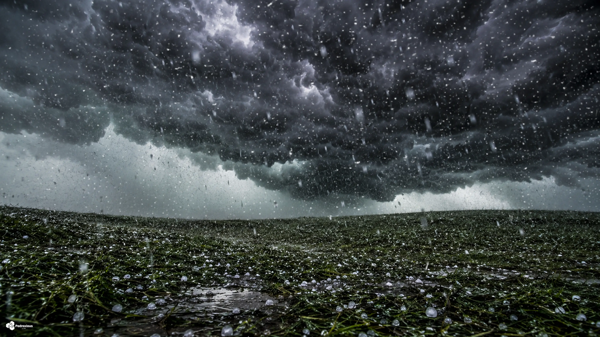

# SkyLog — Global Weather Dashboard

### Monitoramento climático em tempo real de 15 cidades ao redor do mundo

---

### Sync Ativo • Última atualização: 03:23 (BRT)
*Projeto em expansão, operando com automações no GitHub Actions para manter métricas globais atualizadas em tempo real. Consulte o link superior para a versão Web.*

 

## São Paulo, Brasil

<table>
  <tr>
    <td align="center" width="50%">
      
    </td>
    <td align="center" width="50%">
      
    </td>
  </tr>
</table>

| Parâmetro | Medição em Tempo Real |
|:---:|:---:|
| Temperatura | 14.5°C (Sensação: 15.3°C) |
| Variação Diária | 14.4°C — 22.6°C |
| Umidade / Pressão | 100% / 1023.9 hPa |
| Vento / Direção | 4.4 km/h (Direção: 109°) |
| UV / Visibilidade | 0.0 / 0.2 km |
| Condição Atual | Nublado |
| Horário Local | 03:23 |

### Previsão para os Próximos Dias

| Dia | Condição | Temperatura | Índice UV Máximo | Precipitação Prevista |
|:---:|:---:|:---:|:---:|:---:|
| Hoje | ☁️ Nublado | 14.4°C a 22.6°C | UV: 5 | Precip: 0.0 mm |
| Amanhã | ☁️ Nublado | 14.1°C a 24.9°C | UV: 5 | Precip: 0.0 mm |
| 29/06 | ⛅ Parcialmente nublado | 15.2°C a 24.9°C | UV: 5 | Precip: 0.0 mm |

 
 

## Rio de Janeiro, Brasil

<table>
  <tr>
    <td align="center" width="50%">
      
    </td>
    <td align="center" width="50%">
      
    </td>
  </tr>
</table>

| Parâmetro | Medição em Tempo Real |
|:---:|:---:|
| Temperatura | 19.9°C (Sensação: 23.4°C) |
| Variação Diária | 19.1°C — 23.2°C |
| Umidade / Pressão | 97% / 1022.4 hPa |
| Vento / Direção | 1.0 km/h (Direção: 239°) |
| UV / Visibilidade | 0.0 / 0.7 km |
| Condição Atual | Principalmente limpo |
| Horário Local | 03:23 |

### Previsão para os Próximos Dias

| Dia | Condição | Temperatura | Índice UV Máximo | Precipitação Prevista |
|:---:|:---:|:---:|:---:|:---:|
| Hoje | ☁️ Nublado | 19.1°C a 23.2°C | UV: 5 | Precip: 0.0 mm |
| Amanhã | ☁️ Nublado | 19.4°C a 25.1°C | UV: 5 | Precip: 0.0 mm |
| 29/06 | ☁️ Nublado | 18.6°C a 27.6°C | UV: 5 | Precip: 0.0 mm |

 
 

## Buenos Aires, Argentina

<table>
  <tr>
    <td align="center" width="50%">
      
    </td>
    <td align="center" width="50%">
      
    </td>
  </tr>
</table>

| Parâmetro | Medição em Tempo Real |
|:---:|:---:|
| Temperatura | 9.6°C (Sensação: 7.3°C) |
| Variação Diária | 7.8°C — 14.3°C |
| Umidade / Pressão | 89% / 1020.5 hPa |
| Vento / Direção | 11.2 km/h (Direção: 323°) |
| UV / Visibilidade | 0.0 / 40.4 km |
| Condição Atual | Parcialmente nublado |
| Horário Local | 03:23 |

### Previsão para os Próximos Dias

| Dia | Condição | Temperatura | Índice UV Máximo | Precipitação Prevista |
|:---:|:---:|:---:|:---:|:---:|
| Hoje | ☁️ Nublado | 7.8°C a 14.3°C | UV: 3 | Precip: 0.0 mm |
| Amanhã | 🌦️ Chuvisco | 7.8°C a 11.2°C | UV: 3 | Precip: 1.3 mm |
| 29/06 | ☁️ Nublado | 4.3°C a 13.5°C | UV: 3 | Precip: 0.0 mm |

 
 

## Mexico City, México

<table>
  <tr>
    <td align="center" width="50%">
      
    </td>
    <td align="center" width="50%">
      
    </td>
  </tr>
</table>

| Parâmetro | Medição em Tempo Real |
|:---:|:---:|
| Temperatura | 15.0°C (Sensação: 14.9°C) |
| Variação Diária | 13.1°C — 21.0°C |
| Umidade / Pressão | 84% / 1020.5 hPa |
| Vento / Direção | 5.4 km/h (Direção: 320°) |
| UV / Visibilidade | 0.0 / 26.3 km |
| Condição Atual | Principalmente limpo |
| Horário Local | 00:23 |

### Previsão para os Próximos Dias

| Dia | Condição | Temperatura | Índice UV Máximo | Precipitação Prevista |
|:---:|:---:|:---:|:---:|:---:|
| Hoje | 🌨️ Granizo | 13.1°C a 21.0°C | UV: 9 | Precip: 6.7 mm |
| Amanhã | ⛈️ Tempestade | 12.4°C a 22.0°C | UV: 9 | Precip: 11.2 mm |
| 29/06 | ⛈️ Tempestade | 13.8°C a 20.9°C | UV: 9 | Precip: 12.4 mm |

 
 

## Havana, Cuba

<table>
  <tr>
    <td align="center" width="50%">
      
    </td>
    <td align="center" width="50%">
      
    </td>
  </tr>
</table>

| Parâmetro | Medição em Tempo Real |
|:---:|:---:|
| Temperatura | 25.6°C (Sensação: 29.6°C) |
| Variação Diária | 25.0°C — 32.0°C |
| Umidade / Pressão | 84% / 1018.8 hPa |
| Vento / Direção | 8.5 km/h (Direção: 108°) |
| UV / Visibilidade | 0.0 / 36.1 km |
| Condição Atual | Céu limpo |
| Horário Local | 02:23 |

### Previsão para os Próximos Dias

| Dia | Condição | Temperatura | Índice UV Máximo | Precipitação Prevista |
|:---:|:---:|:---:|:---:|:---:|
| Hoje | 🌨️ Granizo | 25.0°C a 32.0°C | UV: 9 | Precip: 2.5 mm |
| Amanhã | 🌪️ Tornado | 25.3°C a 33.1°C | UV: 9 | Precip: 3.1 mm |
| 29/06 | 🌨️ Granizo | 24.9°C a 32.6°C | UV: 9 | Precip: 1.6 mm |

 
 

## Miami, EUA

<table>
  <tr>
    <td align="center" width="50%">
      
    </td>
    <td align="center" width="50%">
      
    </td>
  </tr>
</table>

| Parâmetro | Medição em Tempo Real |
|:---:|:---:|
| Temperatura | 26.9°C (Sensação: 31.5°C) |
| Variação Diária | 26.3°C — 32.8°C |
| Umidade / Pressão | 79% / 1019.7 hPa |
| Vento / Direção | 5.5 km/h (Direção: 113°) |
| UV / Visibilidade | 0.0 / 19.1 km |
| Condição Atual | Tempestade |
| Horário Local | 02:23 |

### Previsão para os Próximos Dias

| Dia | Condição | Temperatura | Índice UV Máximo | Precipitação Prevista |
|:---:|:---:|:---:|:---:|:---:|
| Hoje | ⛈️ Tempestade | 26.3°C a 32.8°C | UV: 9 | Precip: 0.0 mm |
| Amanhã | ⛈️ Tempestade | 25.4°C a 31.7°C | UV: 9 | Precip: 2.2 mm |
| 29/06 | 🌦️ Chuvisco | 28.7°C a 31.7°C | UV: 9 | Precip: 0.2 mm |

 
 

## New York, EUA

<table>
  <tr>
    <td align="center" width="50%">
      
    </td>
    <td align="center" width="50%">
      
    </td>
  </tr>
</table>

| Parâmetro | Medição em Tempo Real |
|:---:|:---:|
| Temperatura | 22.7°C (Sensação: 25.5°C) |
| Variação Diária | 19.4°C — 26.1°C |
| Umidade / Pressão | 80% / 1016.7 hPa |
| Vento / Direção | 4.2 km/h (Direção: 250°) |
| UV / Visibilidade | 0.0 / 19.8 km |
| Condição Atual | Nublado |
| Horário Local | 02:23 |

### Previsão para os Próximos Dias

| Dia | Condição | Temperatura | Índice UV Máximo | Precipitação Prevista |
|:---:|:---:|:---:|:---:|:---:|
| Hoje | 🌦️ Chuvisco | 19.4°C a 26.1°C | UV: 7 | Precip: 0.1 mm |
| Amanhã | 🌧️ Chuva | 19.1°C a 24.1°C | UV: 8 | Precip: 2.9 mm |
| 29/06 | 🌦️ Chuvisco | 21.5°C a 28.1°C | UV: 8 | Precip: 2.1 mm |

 
 

## London, Reino Unido

<table>
  <tr>
    <td align="center" width="50%">
      
    </td>
    <td align="center" width="50%">
      
    </td>
  </tr>
</table>

| Parâmetro | Medição em Tempo Real |
|:---:|:---:|
| Temperatura | 22.0°C (Sensação: 23.6°C) |
| Variação Diária | 21.7°C — 33.6°C |
| Umidade / Pressão | 75% / 1017.7 hPa |
| Vento / Direção | 6.8 km/h (Direção: 197°) |
| UV / Visibilidade | 0.2 / 14.9 km |
| Condição Atual | Principalmente limpo |
| Horário Local | 07:23 |

### Previsão para os Próximos Dias

| Dia | Condição | Temperatura | Índice UV Máximo | Precipitação Prevista |
|:---:|:---:|:---:|:---:|:---:|
| Hoje | 🌧️ Chuva | 21.7°C a 33.6°C | UV: 6 | Precip: 4.8 mm |
| Amanhã | ☁️ Nublado | 18.6°C a 25.2°C | UV: 6 | Precip: 0.0 mm |
| 29/06 | ☁️ Nublado | 15.1°C a 24.8°C | UV: 7 | Precip: 0.0 mm |

 
 

## Paris, França

<table>
  <tr>
    <td align="center" width="50%">
      
    </td>
    <td align="center" width="50%">
      
    </td>
  </tr>
</table>

| Parâmetro | Medição em Tempo Real |
|:---:|:---:|
| Temperatura | 22.6°C (Sensação: 22.3°C) |
| Variação Diária | 22.1°C — 36.0°C |
| Umidade / Pressão | 56% / 1017.4 hPa |
| Vento / Direção | 9.5 km/h (Direção: 9°) |
| UV / Visibilidade | 0.9 / 38.3 km |
| Condição Atual | Parcialmente nublado |
| Horário Local | 08:23 |

### Previsão para os Próximos Dias

| Dia | Condição | Temperatura | Índice UV Máximo | Precipitação Prevista |
|:---:|:---:|:---:|:---:|:---:|
| Hoje | ☁️ Nublado | 22.1°C a 36.0°C | UV: 7 | Precip: 0.0 mm |
| Amanhã | 🌧️ Chuva | 24.3°C a 32.0°C | UV: 7 | Precip: 0.0 mm |
| 29/06 | ☁️ Nublado | 17.8°C a 26.8°C | UV: 7 | Precip: 0.1 mm |

 
 

## Moscow, Rússia

<table>
  <tr>
    <td align="center" width="50%">
      
    </td>
    <td align="center" width="50%">
      
    </td>
  </tr>
</table>

| Parâmetro | Medição em Tempo Real |
|:---:|:---:|
| Temperatura | 18.4°C (Sensação: 18.7°C) |
| Variação Diária | 12.5°C — 19.0°C |
| Umidade / Pressão | 67% / 1016.5 hPa |
| Vento / Direção | 2.6 km/h (Direção: 326°) |
| UV / Visibilidade | 2.8 / 36.9 km |
| Condição Atual | Nublado |
| Horário Local | 09:23 |

### Previsão para os Próximos Dias

| Dia | Condição | Temperatura | Índice UV Máximo | Precipitação Prevista |
|:---:|:---:|:---:|:---:|:---:|
| Hoje | 🌧️ Chuva | 12.5°C a 19.0°C | UV: 6 | Precip: 1.4 mm |
| Amanhã | ☁️ Nublado | 13.4°C a 23.0°C | UV: 6 | Precip: 0.0 mm |
| 29/06 | 🌧️ Chuva | 15.6°C a 19.6°C | UV: 1 | Precip: 4.3 mm |

 
 

## Bangkok, Tailândia

<table>
  <tr>
    <td align="center" width="50%">
      
    </td>
    <td align="center" width="50%">
      
    </td>
  </tr>
</table>

| Parâmetro | Medição em Tempo Real |
|:---:|:---:|
| Temperatura | 33.1°C (Sensação: 39.7°C) |
| Variação Diária | 26.9°C — 33.8°C |
| Umidade / Pressão | 60% / 1007.3 hPa |
| Vento / Direção | 8.3 km/h (Direção: 186°) |
| UV / Visibilidade | 8.5 / 31.8 km |
| Condição Atual | Granizo |
| Horário Local | 13:23 |

### Previsão para os Próximos Dias

| Dia | Condição | Temperatura | Índice UV Máximo | Precipitação Prevista |
|:---:|:---:|:---:|:---:|:---:|
| Hoje | 🌨️ Granizo | 26.9°C a 33.8°C | UV: 9 | Precip: 7.8 mm |
| Amanhã | ⛈️ Tempestade | 26.0°C a 33.7°C | UV: 8 | Precip: 5.1 mm |
| 29/06 | 🌨️ Granizo | 25.8°C a 32.2°C | UV: 8 | Precip: 10.9 mm |

 
 

## Tokyo, Japão

<table>
  <tr>
    <td align="center" width="50%">
      
    </td>
    <td align="center" width="50%">
      
    </td>
  </tr>
</table>

| Parâmetro | Medição em Tempo Real |
|:---:|:---:|
| Temperatura | 22.6°C (Sensação: 27.2°C) |
| Variação Diária | 21.6°C — 22.9°C |
| Umidade / Pressão | 98% / 1001.1 hPa |
| Vento / Direção | 3.6 km/h (Direção: 53°) |
| UV / Visibilidade | 1.1 / 4.3 km |
| Condição Atual | Chuva |
| Horário Local | 15:23 |

### Previsão para os Próximos Dias

| Dia | Condição | Temperatura | Índice UV Máximo | Precipitação Prevista |
|:---:|:---:|:---:|:---:|:---:|
| Hoje | 🌧️ Chuva | 21.6°C a 22.9°C | UV: 3 | Precip: 45.0 mm |
| Amanhã | 🌧️ Chuva | 20.3°C a 25.1°C | UV: 2 | Precip: 3.6 mm |
| 29/06 | 🌦️ Chuvisco | 19.8°C a 23.9°C | UV: 7 | Precip: 2.5 mm |

 
 

## Dubai, Emirados Árabes

<table>
  <tr>
    <td align="center" width="50%">
      
    </td>
    <td align="center" width="50%">
      
    </td>
  </tr>
</table>

| Parâmetro | Medição em Tempo Real |
|:---:|:---:|
| Temperatura | 35.5°C (Sensação: 40.4°C) |
| Variação Diária | 27.2°C — 35.7°C |
| Umidade / Pressão | 42% / 1002.8 hPa |
| Vento / Direção | 6.0 km/h (Direção: 297°) |
| UV / Visibilidade | 6.0 / 18.1 km |
| Condição Atual | Céu limpo |
| Horário Local | 10:23 |

### Previsão para os Próximos Dias

| Dia | Condição | Temperatura | Índice UV Máximo | Precipitação Prevista |
|:---:|:---:|:---:|:---:|:---:|
| Hoje | ☀️ Céu limpo | 27.2°C a 35.7°C | UV: 9 | Precip: 0.0 mm |
| Amanhã | ☀️ Céu limpo | 30.5°C a 39.0°C | UV: 9 | Precip: 0.0 mm |
| 29/06 | ☀️ Céu limpo | 29.7°C a 38.6°C | UV: 9 | Precip: 0.0 mm |

 
 

## Cairo, Egito

<table>
  <tr>
    <td align="center" width="50%">
      
    </td>
    <td align="center" width="50%">
      
    </td>
  </tr>
</table>

| Parâmetro | Medição em Tempo Real |
|:---:|:---:|
| Temperatura | 26.5°C (Sensação: 29.3°C) |
| Variação Diária | 22.7°C — 36.2°C |
| Umidade / Pressão | 62% / 1012.1 hPa |
| Vento / Direção | 4.2 km/h (Direção: 340°) |
| UV / Visibilidade | 2.5 / 38.1 km |
| Condição Atual | Céu limpo |
| Horário Local | 09:23 |

### Previsão para os Próximos Dias

| Dia | Condição | Temperatura | Índice UV Máximo | Precipitação Prevista |
|:---:|:---:|:---:|:---:|:---:|
| Hoje | ⛅ Parcialmente nublado | 22.7°C a 36.2°C | UV: 8 | Precip: 0.0 mm |
| Amanhã | 🌤️ Principalmente limpo | 23.2°C a 36.8°C | UV: 8 | Precip: 0.0 mm |
| 29/06 | ⛅ Parcialmente nublado | 23.0°C a 38.0°C | UV: 8 | Precip: 0.0 mm |

 
 

## Histórico de Dados

| Estatística | Valor |
|:---:|:---:|
| Total de registros | 4604 |
| Primeiro registro | `datetime` |
| Último registro | `2026-06-27 09:23` |
| Temperatura mais alta | **42.4°C** — Dubai |
| Temperatura mais baixa | **3.5°C** — Buenos Aires |

📂 <a href="data/history.csv">Ver histórico completo (history.csv)</a>

---

### Informações Técnicas

| Item | Detalhe |
|:---:|:---:|
| Fonte de dados | <a href="https://open-meteo.com/">Open-Meteo API</a> (gratuita) |
| Frequência | 24× ao dia (a cada hora) |
| Automação | GitHub Actions — <a href=".github/workflows/weather.yml">ver workflow</a> |
| Script | `update_weather.py` (requests e pytz) |
| Cidades Monitoradas | 15 cidades globais |

---

**Feito com amor por [Pedroxious](https://github.com/Pedroxious) · Dados: [Open-Meteo](https://open-meteo.com/)**

