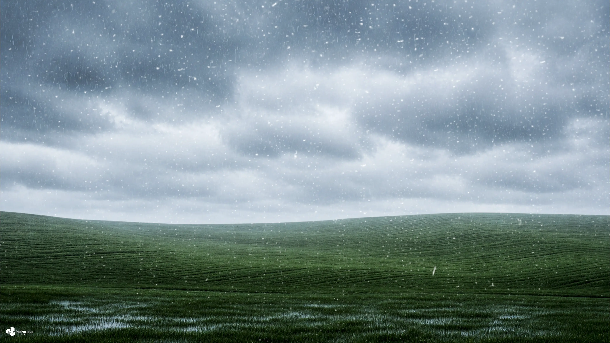

# SkyLog — Global Weather Dashboard

### Monitoramento climático em tempo real de 15 cidades ao redor do mundo

---

### Sync Ativo • Última atualização: 09:03 (BRT)
*Projeto em expansão, operando com automações no GitHub Actions para manter métricas globais atualizadas em tempo real. Consulte o link superior para a versão Web.*

 

## São Paulo, Brasil

<table>
  <tr>
    <td align="center" width="50%">
      
    </td>
    <td align="center" width="50%">
      
    </td>
  </tr>
</table>

| Parâmetro | Medição em Tempo Real |
|:---:|:---:|
| Temperatura | 20.1°C (Sensação: 20.0°C) |
| Variação Diária | 14.2°C — 25.4°C |
| Umidade / Pressão | 61% / 1022.7 hPa |
| Vento / Direção | 5.4 km/h (Direção: 334°) |
| UV / Visibilidade | 1.6 / 32.9 km |
| Condição Atual | Céu limpo |
| Horário Local | 09:03 |

### Previsão para os Próximos Dias

| Dia | Condição | Temperatura | Índice UV Máximo | Precipitação Prevista |
|:---:|:---:|:---:|:---:|:---:|
| Hoje | ☀️ Céu limpo | 14.2°C a 25.4°C | UV: 5 | Precip: 0.0 mm |
| Amanhã | ☁️ Nublado | 13.4°C a 24.6°C | UV: 5 | Precip: 0.0 mm |
| 04/07 | ☁️ Nublado | 12.0°C a 17.6°C | UV: 2 | Precip: 0.0 mm |

 
 

## Rio de Janeiro, Brasil

<table>
  <tr>
    <td align="center" width="50%">
      
    </td>
    <td align="center" width="50%">
      
    </td>
  </tr>
</table>

| Parâmetro | Medição em Tempo Real |
|:---:|:---:|
| Temperatura | 23.9°C (Sensação: 27.1°C) |
| Variação Diária | 20.1°C — 27.2°C |
| Umidade / Pressão | 82% / 1020.1 hPa |
| Vento / Direção | 6.8 km/h (Direção: 357°) |
| UV / Visibilidade | 1.9 / 29.9 km |
| Condição Atual | Céu limpo |
| Horário Local | 09:03 |

### Previsão para os Próximos Dias

| Dia | Condição | Temperatura | Índice UV Máximo | Precipitação Prevista |
|:---:|:---:|:---:|:---:|:---:|
| Hoje | ☀️ Céu limpo | 20.1°C a 27.2°C | UV: 5 | Precip: 0.0 mm |
| Amanhã | 🌦️ Chuvisco | 19.6°C a 25.6°C | UV: 5 | Precip: 0.2 mm |
| 04/07 | 🌦️ Chuvisco | 19.2°C a 22.5°C | UV: 4 | Precip: 5.6 mm |

 
 

## Buenos Aires, Argentina

<table>
  <tr>
    <td align="center" width="50%">
      
    </td>
    <td align="center" width="50%">
      
    </td>
  </tr>
</table>

| Parâmetro | Medição em Tempo Real |
|:---:|:---:|
| Temperatura | 2.0°C (Sensação: -1.9°C) |
| Variação Diária | 1.9°C — 7.9°C |
| Umidade / Pressão | 77% / 1033.4 hPa |
| Vento / Direção | 9.8 km/h (Direção: 206°) |
| UV / Visibilidade | 0.2 / 48.4 km |
| Condição Atual | Céu limpo |
| Horário Local | 09:03 |

### Previsão para os Próximos Dias

| Dia | Condição | Temperatura | Índice UV Máximo | Precipitação Prevista |
|:---:|:---:|:---:|:---:|:---:|
| Hoje | ☁️ Nublado | 1.9°C a 7.9°C | UV: 3 | Precip: 0.0 mm |
| Amanhã | ⛅ Parcialmente nublado | 0.6°C a 8.2°C | UV: 3 | Precip: 0.0 mm |
| 04/07 | ☁️ Nublado | 4.2°C a 10.5°C | UV: 2 | Precip: 0.0 mm |

 
 

## Mexico City, México

<table>
  <tr>
    <td align="center" width="50%">
      
    </td>
    <td align="center" width="50%">
      
    </td>
  </tr>
</table>

| Parâmetro | Medição em Tempo Real |
|:---:|:---:|
| Temperatura | 12.3°C (Sensação: 12.2°C) |
| Variação Diária | 12.0°C — 21.2°C |
| Umidade / Pressão | 97% / 1020.5 hPa |
| Vento / Direção | 4.9 km/h (Direção: 336°) |
| UV / Visibilidade | 0.0 / 0.7 km |
| Condição Atual | Nublado |
| Horário Local | 06:03 |

### Previsão para os Próximos Dias

| Dia | Condição | Temperatura | Índice UV Máximo | Precipitação Prevista |
|:---:|:---:|:---:|:---:|:---:|
| Hoje | ⛈️ Tempestade | 12.0°C a 21.2°C | UV: 10 | Precip: 8.5 mm |
| Amanhã | 🌨️ Granizo | 11.5°C a 22.9°C | UV: 10 | Precip: 5.3 mm |
| 04/07 | 🌨️ Granizo | 12.5°C a 22.5°C | UV: 9 | Precip: 7.7 mm |

 
 

## Havana, Cuba

<table>
  <tr>
    <td align="center" width="50%">
      
    </td>
    <td align="center" width="50%">
      
    </td>
  </tr>
</table>

| Parâmetro | Medição em Tempo Real |
|:---:|:---:|
| Temperatura | 26.3°C (Sensação: 31.3°C) |
| Variação Diária | 25.1°C — 33.0°C |
| Umidade / Pressão | 85% / 1015.6 hPa |
| Vento / Direção | 6.0 km/h (Direção: 107°) |
| UV / Visibilidade | 0.5 / 36.2 km |
| Condição Atual | Céu limpo |
| Horário Local | 08:03 |

### Previsão para os Próximos Dias

| Dia | Condição | Temperatura | Índice UV Máximo | Precipitação Prevista |
|:---:|:---:|:---:|:---:|:---:|
| Hoje | ⛈️ Tempestade | 25.1°C a 33.0°C | UV: 9 | Precip: 2.2 mm |
| Amanhã | 🌦️ Chuvisco | 25.1°C a 32.5°C | UV: 9 | Precip: 0.4 mm |
| 04/07 | 🌪️ Tornado | 24.7°C a 32.4°C | UV: 9 | Precip: 13.0 mm |

 
 

## Miami, EUA

<table>
  <tr>
    <td align="center" width="50%">
      
    </td>
    <td align="center" width="50%">
      
    </td>
  </tr>
</table>

| Parâmetro | Medição em Tempo Real |
|:---:|:---:|
| Temperatura | 24.5°C (Sensação: 28.5°C) |
| Variação Diária | 24.5°C — 29.6°C |
| Umidade / Pressão | 90% / 1015.6 hPa |
| Vento / Direção | 8.7 km/h (Direção: 85°) |
| UV / Visibilidade | 0.7 / 8.5 km |
| Condição Atual | Chuva |
| Horário Local | 08:03 |

### Previsão para os Próximos Dias

| Dia | Condição | Temperatura | Índice UV Máximo | Precipitação Prevista |
|:---:|:---:|:---:|:---:|:---:|
| Hoje | ⛈️ Tempestade | 24.5°C a 29.6°C | UV: 7 | Precip: 11.2 mm |
| Amanhã | ☁️ Nublado | 24.4°C a 31.5°C | UV: 9 | Precip: 0.0 mm |
| 04/07 | ⛈️ Tempestade | 26.3°C a 31.7°C | UV: 9 | Precip: 4.2 mm |

 
 

## New York, EUA

<table>
  <tr>
    <td align="center" width="50%">
      
    </td>
    <td align="center" width="50%">
      
    </td>
  </tr>
</table>

| Parâmetro | Medição em Tempo Real |
|:---:|:---:|
| Temperatura | 30.5°C (Sensação: 34.9°C) |
| Variação Diária | 26.5°C — 39.5°C |
| Umidade / Pressão | 64% / 1015.1 hPa |
| Vento / Direção | 7.6 km/h (Direção: 278°) |
| UV / Visibilidade | 1.6 / 26.0 km |
| Condição Atual | Céu limpo |
| Horário Local | 08:03 |

### Previsão para os Próximos Dias

| Dia | Condição | Temperatura | Índice UV Máximo | Precipitação Prevista |
|:---:|:---:|:---:|:---:|:---:|
| Hoje | 🌫️ Neblina | 26.5°C a 39.5°C | UV: 8 | Precip: 0.0 mm |
| Amanhã | 🌤️ Principalmente limpo | 27.0°C a 40.0°C | UV: 8 | Precip: 0.0 mm |
| 04/07 | 🌦️ Chuvisco | 25.4°C a 35.6°C | UV: 8 | Precip: 1.9 mm |

 
 

## London, Reino Unido

<table>
  <tr>
    <td align="center" width="50%">
      
    </td>
    <td align="center" width="50%">
      
    </td>
  </tr>
</table>

| Parâmetro | Medição em Tempo Real |
|:---:|:---:|
| Temperatura | 24.8°C (Sensação: 23.3°C) |
| Variação Diária | 16.9°C — 25.5°C |
| Umidade / Pressão | 33% / 1021.4 hPa |
| Vento / Direção | 17.3 km/h (Direção: 304°) |
| UV / Visibilidade | 5.9 / 27.8 km |
| Condição Atual | Nublado |
| Horário Local | 13:03 |

### Previsão para os Próximos Dias

| Dia | Condição | Temperatura | Índice UV Máximo | Precipitação Prevista |
|:---:|:---:|:---:|:---:|:---:|
| Hoje | ☁️ Nublado | 16.9°C a 25.5°C | UV: 6 | Precip: 0.0 mm |
| Amanhã | ☁️ Nublado | 15.3°C a 25.8°C | UV: 6 | Precip: 0.0 mm |
| 04/07 | ☁️ Nublado | 16.3°C a 25.7°C | UV: 7 | Precip: 0.0 mm |

 
 

## Paris, França

<table>
  <tr>
    <td align="center" width="50%">
      
    </td>
    <td align="center" width="50%">
      
    </td>
  </tr>
</table>

| Parâmetro | Medição em Tempo Real |
|:---:|:---:|
| Temperatura | 23.4°C (Sensação: 22.8°C) |
| Variação Diária | 15.6°C — 23.9°C |
| Umidade / Pressão | 60% / 1024.0 hPa |
| Vento / Direção | 15.6 km/h (Direção: 285°) |
| UV / Visibilidade | 3.6 / 39.0 km |
| Condição Atual | Nublado |
| Horário Local | 14:03 |

### Previsão para os Próximos Dias

| Dia | Condição | Temperatura | Índice UV Máximo | Precipitação Prevista |
|:---:|:---:|:---:|:---:|:---:|
| Hoje | ☁️ Nublado | 15.6°C a 23.9°C | UV: 5 | Precip: 0.0 mm |
| Amanhã | 🌤️ Principalmente limpo | 16.8°C a 28.0°C | UV: 7 | Precip: 0.0 mm |
| 04/07 | ☀️ Céu limpo | 17.4°C a 29.8°C | UV: 7 | Precip: 0.0 mm |

 
 

## Moscow, Rússia

<table>
  <tr>
    <td align="center" width="50%">
      
    </td>
    <td align="center" width="50%">
      
    </td>
  </tr>
</table>

| Parâmetro | Medição em Tempo Real |
|:---:|:---:|
| Temperatura | 30.2°C (Sensação: 30.5°C) |
| Variação Diária | 17.9°C — 30.2°C |
| Umidade / Pressão | 35% / 1010.0 hPa |
| Vento / Direção | 9.4 km/h (Direção: 187°) |
| UV / Visibilidade | 5.4 / 44.2 km |
| Condição Atual | Principalmente limpo |
| Horário Local | 15:03 |

### Previsão para os Próximos Dias

| Dia | Condição | Temperatura | Índice UV Máximo | Precipitação Prevista |
|:---:|:---:|:---:|:---:|:---:|
| Hoje | ☁️ Nublado | 17.9°C a 30.2°C | UV: 6 | Precip: 0.0 mm |
| Amanhã | ☁️ Nublado | 18.2°C a 26.1°C | UV: 6 | Precip: 0.1 mm |
| 04/07 | 🌧️ Chuva | 16.5°C a 19.7°C | UV: 3 | Precip: 16.7 mm |

 
 

## Bangkok, Tailândia

<table>
  <tr>
    <td align="center" width="50%">
      
    </td>
    <td align="center" width="50%">
      
    </td>
  </tr>
</table>

| Parâmetro | Medição em Tempo Real |
|:---:|:---:|
| Temperatura | 29.2°C (Sensação: 34.7°C) |
| Variação Diária | 26.0°C — 32.9°C |
| Umidade / Pressão | 77% / 1005.5 hPa |
| Vento / Direção | 6.6 km/h (Direção: 217°) |
| UV / Visibilidade | 0.1 / 35.3 km |
| Condição Atual | Nublado |
| Horário Local | 19:03 |

### Previsão para os Próximos Dias

| Dia | Condição | Temperatura | Índice UV Máximo | Precipitação Prevista |
|:---:|:---:|:---:|:---:|:---:|
| Hoje | ⛈️ Tempestade | 26.0°C a 32.9°C | UV: 8 | Precip: 5.0 mm |
| Amanhã | 🌦️ Chuvisco | 27.1°C a 34.0°C | UV: 6 | Precip: 2.6 mm |
| 04/07 | ⛈️ Tempestade | 25.8°C a 31.9°C | UV: 2 | Precip: 4.9 mm |

 
 

## Tokyo, Japão

<table>
  <tr>
    <td align="center" width="50%">
      
    </td>
    <td align="center" width="50%">
      
    </td>
  </tr>
</table>

| Parâmetro | Medição em Tempo Real |
|:---:|:---:|
| Temperatura | 21.8°C (Sensação: 24.9°C) |
| Variação Diária | 20.4°C — 23.4°C |
| Umidade / Pressão | 85% / 1007.5 hPa |
| Vento / Direção | 2.5 km/h (Direção: 360°) |
| UV / Visibilidade | 0.0 / 18.7 km |
| Condição Atual | Principalmente limpo |
| Horário Local | 21:03 |

### Previsão para os Próximos Dias

| Dia | Condição | Temperatura | Índice UV Máximo | Precipitação Prevista |
|:---:|:---:|:---:|:---:|:---:|
| Hoje | 🌧️ Chuva | 20.4°C a 23.4°C | UV: 1 | Precip: 48.9 mm |
| Amanhã | ☁️ Nublado | 20.1°C a 24.9°C | UV: 6 | Precip: 0.0 mm |
| 04/07 | ☁️ Nublado | 20.1°C a 25.8°C | UV: 5 | Precip: 0.0 mm |

 
 

## Dubai, Emirados Árabes

<table>
  <tr>
    <td align="center" width="50%">
      
    </td>
    <td align="center" width="50%">
      
    </td>
  </tr>
</table>

| Parâmetro | Medição em Tempo Real |
|:---:|:---:|
| Temperatura | 36.3°C (Sensação: 40.1°C) |
| Variação Diária | 29.5°C — 38.9°C |
| Umidade / Pressão | 48% / 996.2 hPa |
| Vento / Direção | 14.6 km/h (Direção: 291°) |
| UV / Visibilidade | 5.5 / 17.6 km |
| Condição Atual | Céu limpo |
| Horário Local | 16:03 |

### Previsão para os Próximos Dias

| Dia | Condição | Temperatura | Índice UV Máximo | Precipitação Prevista |
|:---:|:---:|:---:|:---:|:---:|
| Hoje | ☁️ Nublado | 29.5°C a 38.9°C | UV: 9 | Precip: 0.0 mm |
| Amanhã | ☀️ Céu limpo | 28.9°C a 40.5°C | UV: 9 | Precip: 0.0 mm |
| 04/07 | ☀️ Céu limpo | 31.3°C a 38.9°C | UV: 9 | Precip: 0.0 mm |

 
 

## Histórico de Dados

| Estatística | Valor |
|:---:|:---:|
| Total de registros | 5208 |
| Primeiro registro | `datetime` |
| Último registro | `2026-07-02 16:03` |
| Temperatura mais alta | **42.4°C** — Dubai |
| Temperatura mais baixa | **2.0°C** — Buenos Aires |

📂 <a href="data/history.csv">Ver histórico completo (history.csv)</a>

---

### Informações Técnicas

| Item | Detalhe |
|:---:|:---:|
| Fonte de dados | <a href="https://open-meteo.com/">Open-Meteo API</a> (gratuita) |
| Frequência | 24× ao dia (a cada hora) |
| Automação | GitHub Actions — <a href=".github/workflows/weather.yml">ver workflow</a> |
| Script | `update_weather.py` (requests e pytz) |
| Cidades Monitoradas | 15 cidades globais |

---

**Feito com amor por [Pedroxious](https://github.com/Pedroxious) · Dados: [Open-Meteo](https://open-meteo.com/)**

