# 🌍 SkyLog — Global Weather Dashboard

### Monitoramento climático em tempo real de 12 cidades ao redor do mundo

---

### Sync Ativo • Última atualização: 14:29 (BRT)
*Projeto em expansão, operando com automações no GitHub Actions para manter métricas globais atualizadas em tempo real. Consulte a aba superior para a versão Web.*

 

## 🏙️ São Paulo, Brasil

<table>
  <tr>
    <td align="center" width="50%">
      
    </td>
    <td align="center" width="50%">
      
    </td>
  </tr>
</table>

| Parâmetro | Medição em Tempo Real |
|:---:|:---:|
| **Temperatura** | 24.2°C (Sensação: 25.0°C) |
| **Variação (Mín/Máx)** | 16.1°C — 24.3°C |
| **Umidade** | 61% |
| **Vento** | 8.8 km/h |
| **Condição Atual** | Nublado |
| **Horário Local** | 14:27 |

 
 

## 🏙️ Rio de Janeiro, Brasil

<table>
  <tr>
    <td align="center" width="50%">
      
    </td>
    <td align="center" width="50%">
      
    </td>
  </tr>
</table>

| Parâmetro | Medição em Tempo Real |
|:---:|:---:|
| **Temperatura** | 24.3°C (Sensação: 26.3°C) |
| **Variação (Mín/Máx)** | 20.3°C — 25.1°C |
| **Umidade** | 79% |
| **Vento** | 14.5 km/h |
| **Condição Atual** | Nublado |
| **Horário Local** | 14:28 |

 
 

## 🏙️ Buenos Aires, Argentina

<table>
  <tr>
    <td align="center" width="50%">
      
    </td>
    <td align="center" width="50%">
      
    </td>
  </tr>
</table>

| Parâmetro | Medição em Tempo Real |
|:---:|:---:|
| **Temperatura** | 14.8°C (Sensação: 14.3°C) |
| **Variação (Mín/Máx)** | 7.8°C — 14.8°C |
| **Umidade** | 73% |
| **Vento** | 3.4 km/h |
| **Condição Atual** | Céu limpo |
| **Horário Local** | 14:28 |

 
 

## 🏙️ Mexico City, México

<table>
  <tr>
    <td align="center" width="50%">
      
    </td>
    <td align="center" width="50%">
      
    </td>
  </tr>
</table>

| Parâmetro | Medição em Tempo Real |
|:---:|:---:|
| **Temperatura** | 22.0°C (Sensação: 24.8°C) |
| **Variação (Mín/Máx)** | 12.9°C — 24.0°C |
| **Umidade** | 54% |
| **Vento** | 2.2 km/h |
| **Condição Atual** | Parcialmente nublado |
| **Horário Local** | 11:28 |

 
 

## 🏙️ New York, EUA

<table>
  <tr>
    <td align="center" width="50%">
      
    </td>
    <td align="center" width="50%">
      
    </td>
  </tr>
</table>

| Parâmetro | Medição em Tempo Real |
|:---:|:---:|
| **Temperatura** | 27.3°C (Sensação: 28.9°C) |
| **Variação (Mín/Máx)** | 14.6°C — 27.1°C |
| **Umidade** | 32% |
| **Vento** | 4.0 km/h |
| **Condição Atual** | Nublado |
| **Horário Local** | 13:28 |

 
 

## 🏙️ Miami, EUA

<table>
  <tr>
    <td align="center" width="50%">
      
    </td>
    <td align="center" width="50%">
      
    </td>
  </tr>
</table>

| Parâmetro | Medição em Tempo Real |
|:---:|:---:|
| **Temperatura** | 29.6°C (Sensação: 32.8°C) |
| **Variação (Mín/Máx)** | 24.7°C — 30.7°C |
| **Umidade** | 71% |
| **Vento** | 24.3 km/h |
| **Condição Atual** | Principalmente limpo |
| **Horário Local** | 13:28 |

 
 

## 🏙️ Moscow, Rússia

<table>
  <tr>
    <td align="center" width="50%">
      
    </td>
    <td align="center" width="50%">
      
    </td>
  </tr>
</table>

| Parâmetro | Medição em Tempo Real |
|:---:|:---:|
| **Temperatura** | 10.3°C (Sensação: 7.9°C) |
| **Variação (Mín/Máx)** | 8.8°C — 14.3°C |
| **Umidade** | 70% |
| **Vento** | 8.5 km/h |
| **Condição Atual** | Chuva |
| **Horário Local** | 20:28 |

 
 

## 🏙️ Havana, Cuba

<table>
  <tr>
    <td align="center" width="50%">
      
    </td>
    <td align="center" width="50%">
      
    </td>
  </tr>
</table>

| Parâmetro | Medição em Tempo Real |
|:---:|:---:|
| **Temperatura** | 32.0°C (Sensação: 36.2°C) |
| **Variação (Mín/Máx)** | 24.0°C — 32.4°C |
| **Umidade** | 51% |
| **Vento** | 14.7 km/h |
| **Condição Atual** | Chuvisco |
| **Horário Local** | 13:28 |

 
 

## 🏙️ Bangkok, Tailândia

<table>
  <tr>
    <td align="center" width="50%">
      
    </td>
    <td align="center" width="50%">
      
    </td>
  </tr>
</table>

| Parâmetro | Medição em Tempo Real |
|:---:|:---:|
| **Temperatura** | 26.6°C (Sensação: 31.6°C) |
| **Variação (Mín/Máx)** | 26.5°C — 33.9°C |
| **Umidade** | 91% |
| **Vento** | 12.1 km/h |
| **Condição Atual** | Chuvisco |
| **Horário Local** | 00:28 |

 
 

## 🏙️ London, Reino Unido

<table>
  <tr>
    <td align="center" width="50%">
      
    </td>
    <td align="center" width="50%">
      
    </td>
  </tr>
</table>

| Parâmetro | Medição em Tempo Real |
|:---:|:---:|
| **Temperatura** | 34.0°C (Sensação: 32.2°C) |
| **Variação (Mín/Máx)** | 21.3°C — 34.7°C |
| **Umidade** | 23% |
| **Vento** | 12.6 km/h |
| **Condição Atual** | Céu limpo |
| **Horário Local** | 18:28 |

 
 

 

    <i>🚀 Novas cidades da Ásia e Europa estão planejadas para as próximas atualizações. Fique ligado!</i>

## 📊 Histórico de Dados

| Estatística | Valor |
|:---:|:---:|
| **Total de registros** | 765 |
| **Primeiro registro** | `2026-05-17 19:38` |
| **Último registro** | `2026-05-26 18:28` |
| **Temperatura mais alta** | **38.0°C** — Dubai |
| **Temperatura mais baixa** | **5.7°C** — Buenos Aires |

📂 <a href="data/history.csv">Ver histórico completo (history.csv)</a>

---

### ⚙️ Informações Técnicas

| Item | Detalhe |
|:---:|:---:|
| **Fonte de dados** | <a href="https://open-meteo.com/">Open-Meteo API</a> (gratuita) |
| **Frequência** | 12× ao dia (a cada 2 horas dia e noite) |
| **Automação** | GitHub Actions — <a href=".github/workflows/weather.yml">ver workflow</a> |
| **Script** | `update_weather.py` (requests e pytz) |
| **Cidades Monitoradas** | 12 cidades globais |

---

**Feito com 💙 por [Pedroxious](https://github.com/Pedroxious) · Dados: [Open-Meteo](https://open-meteo.com/)**

