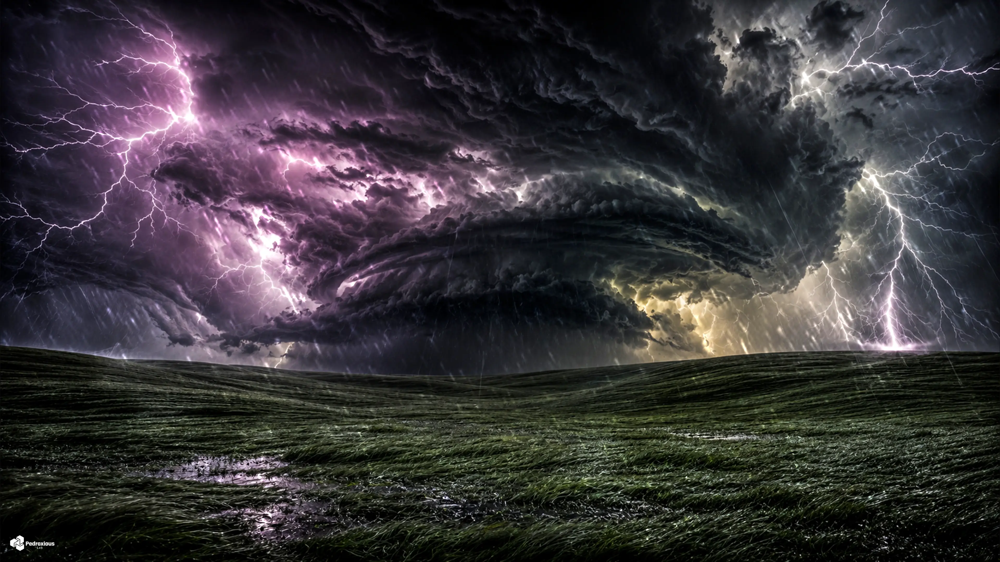

# SkyLog — Global Weather Dashboard

### Monitoramento climático em tempo real de 15 cidades ao redor do mundo

---

### Sync Ativo • Última atualização: 12:19 (BRT)
*Projeto em expansão, operando com automações no GitHub Actions para manter métricas globais atualizadas em tempo real. Consulte o link superior para a versão Web.*

 

## São Paulo, Brasil

<table>
  <tr>
    <td align="center" width="50%">
      
    </td>
    <td align="center" width="50%">
      
    </td>
  </tr>
</table>

| Parâmetro | Medição em Tempo Real |
|:---:|:---:|
| Temperatura | 19.1°C (Sensação: 19.5°C) |
| Variação Diária | 13.9°C — 20.8°C |
| Umidade / Pressão | 92% / 1012.2 hPa |
| Vento / Direção | 16.1 km/h (Direção: 319°) |
| UV / Visibilidade | 1.7 / 1.5 km |
| Condição Atual | Tempestade |
| Horário Local | 12:19 |

### Previsão para os Próximos Dias

| Dia | Condição | Temperatura | Índice UV Máximo | Precipitação Prevista |
|:---:|:---:|:---:|:---:|:---:|
| Hoje | ⛈️ Tempestade | 13.9°C a 20.8°C | UV: 7 | Precip: 32.6 mm |
| Amanhã | ☁️ Nublado | 12.4°C a 20.3°C | UV: 6 | Precip: 0.0 mm |
| 03/09 | ☁️ Nublado | 11.3°C a 25.1°C | UV: 7 | Precip: 0.0 mm |

 
 

## Rio de Janeiro, Brasil

<table>
  <tr>
    <td align="center" width="50%">
      
    </td>
    <td align="center" width="50%">
      
    </td>
  </tr>
</table>

| Parâmetro | Medição em Tempo Real |
|:---:|:---:|
| Temperatura | 26.8°C (Sensação: 31.2°C) |
| Variação Diária | 20.1°C — 26.8°C |
| Umidade / Pressão | 71% / 1009.5 hPa |
| Vento / Direção | 9.1 km/h (Direção: 139°) |
| UV / Visibilidade | 5.5 / 28.5 km |
| Condição Atual | Parcialmente nublado |
| Horário Local | 12:19 |

### Previsão para os Próximos Dias

| Dia | Condição | Temperatura | Índice UV Máximo | Precipitação Prevista |
|:---:|:---:|:---:|:---:|:---:|
| Hoje | ⛈️ Tempestade | 20.1°C a 26.8°C | UV: 6 | Precip: 28.9 mm |
| Amanhã | 🌦️ Chuvisco | 18.7°C a 22.5°C | UV: 6 | Precip: 0.9 mm |
| 03/09 | ☀️ Céu limpo | 17.0°C a 24.8°C | UV: 7 | Precip: 0.0 mm |

 
 

## Buenos Aires, Argentina

<table>
  <tr>
    <td align="center" width="50%">
      
    </td>
    <td align="center" width="50%">
      
    </td>
  </tr>
</table>

| Parâmetro | Medição em Tempo Real |
|:---:|:---:|
| Temperatura | 17.2°C (Sensação: 17.7°C) |
| Variação Diária | 10.3°C — 17.6°C |
| Umidade / Pressão | 65% / 1021.1 hPa |
| Vento / Direção | 4.7 km/h (Direção: 99°) |
| UV / Visibilidade | 4.9 / 48.5 km |
| Condição Atual | Principalmente limpo |
| Horário Local | 12:19 |

### Previsão para os Próximos Dias

| Dia | Condição | Temperatura | Índice UV Máximo | Precipitação Prevista |
|:---:|:---:|:---:|:---:|:---:|
| Hoje | ☁️ Nublado | 10.3°C a 17.6°C | UV: 5 | Precip: 0.0 mm |
| Amanhã | ⛈️ Tempestade | 10.1°C a 20.8°C | UV: 5 | Precip: 4.9 mm |
| 03/09 | ⛈️ Tempestade | 11.8°C a 17.8°C | UV: 5 | Precip: 6.7 mm |

 
 

## Mexico City, México

<table>
  <tr>
    <td align="center" width="50%">
      
    </td>
    <td align="center" width="50%">
      
    </td>
  </tr>
</table>

| Parâmetro | Medição em Tempo Real |
|:---:|:---:|
| Temperatura | 16.6°C (Sensação: 17.1°C) |
| Variação Diária | 13.4°C — 21.6°C |
| Umidade / Pressão | 75% / 1021.7 hPa |
| Vento / Direção | 1.3 km/h (Direção: 236°) |
| UV / Visibilidade | 1.6 / 37.7 km |
| Condição Atual | Parcialmente nublado |
| Horário Local | 09:19 |

### Previsão para os Próximos Dias

| Dia | Condição | Temperatura | Índice UV Máximo | Precipitação Prevista |
|:---:|:---:|:---:|:---:|:---:|
| Hoje | 🌦️ Chuvisco | 13.4°C a 21.6°C | UV: 9 | Precip: 5.0 mm |
| Amanhã | ⛈️ Tempestade | 13.4°C a 22.5°C | UV: 3 | Precip: 10.7 mm |
| 03/09 | 🌧️ Chuva | 13.7°C a 24.1°C | UV: 10 | Precip: 3.7 mm |

 
 

## Havana, Cuba

<table>
  <tr>
    <td align="center" width="50%">
      
    </td>
    <td align="center" width="50%">
      
    </td>
  </tr>
</table>

| Parâmetro | Medição em Tempo Real |
|:---:|:---:|
| Temperatura | 31.8°C (Sensação: 37.4°C) |
| Variação Diária | 25.7°C — 32.4°C |
| Umidade / Pressão | 60% / 1015.9 hPa |
| Vento / Direção | 7.6 km/h (Direção: 38°) |
| UV / Visibilidade | 5.3 / 14.8 km |
| Condição Atual | Principalmente limpo |
| Horário Local | 11:19 |

### Previsão para os Próximos Dias

| Dia | Condição | Temperatura | Índice UV Máximo | Precipitação Prevista |
|:---:|:---:|:---:|:---:|:---:|
| Hoje | ⛈️ Tempestade | 25.7°C a 32.4°C | UV: 9 | Precip: 3.2 mm |
| Amanhã | ⛈️ Tempestade | 25.8°C a 32.4°C | UV: 8 | Precip: 3.6 mm |
| 03/09 | 🌨️ Granizo | 25.5°C a 32.3°C | UV: 9 | Precip: 9.0 mm |

 
 

## Miami, EUA

<table>
  <tr>
    <td align="center" width="50%">
      
    </td>
    <td align="center" width="50%">
      
    </td>
  </tr>
</table>

| Parâmetro | Medição em Tempo Real |
|:---:|:---:|
| Temperatura | 29.4°C (Sensação: 37.1°C) |
| Variação Diária | 25.0°C — 29.9°C |
| Umidade / Pressão | 80% / 1016.3 hPa |
| Vento / Direção | 5.9 km/h (Direção: 38°) |
| UV / Visibilidade | 5.5 / 19.5 km |
| Condição Atual | Nublado |
| Horário Local | 11:19 |

### Previsão para os Próximos Dias

| Dia | Condição | Temperatura | Índice UV Máximo | Precipitação Prevista |
|:---:|:---:|:---:|:---:|:---:|
| Hoje | 🌧️ Chuva | 25.0°C a 29.9°C | UV: 8 | Precip: 2.1 mm |
| Amanhã | ☁️ Nublado | 24.5°C a 30.4°C | UV: 8 | Precip: 0.0 mm |
| 03/09 | ⛈️ Tempestade | 26.1°C a 31.2°C | UV: 7 | Precip: 3.1 mm |

 
 

## New York, EUA

<table>
  <tr>
    <td align="center" width="50%">
      
    </td>
    <td align="center" width="50%">
      
    </td>
  </tr>
</table>

| Parâmetro | Medição em Tempo Real |
|:---:|:---:|
| Temperatura | 24.2°C (Sensação: 27.9°C) |
| Variação Diária | 21.4°C — 26.3°C |
| Umidade / Pressão | 89% / 1014.7 hPa |
| Vento / Direção | 9.5 km/h (Direção: 191°) |
| UV / Visibilidade | 4.4 / 15.1 km |
| Condição Atual | Nublado |
| Horário Local | 11:19 |

### Previsão para os Próximos Dias

| Dia | Condição | Temperatura | Índice UV Máximo | Precipitação Prevista |
|:---:|:---:|:---:|:---:|:---:|
| Hoje | 🌧️ Chuva | 21.4°C a 26.3°C | UV: 6 | Precip: 6.9 mm |
| Amanhã | 🌧️ Chuva | 19.6°C a 21.7°C | UV: 3 | Precip: 6.0 mm |
| 03/09 | 🌧️ Chuva | 20.4°C a 28.5°C | UV: 6 | Precip: 3.5 mm |

 
 

## London, Reino Unido

<table>
  <tr>
    <td align="center" width="50%">
      
    </td>
    <td align="center" width="50%">
      
    </td>
  </tr>
</table>

| Parâmetro | Medição em Tempo Real |
|:---:|:---:|
| Temperatura | 22.3°C (Sensação: 19.9°C) |
| Variação Diária | 13.8°C — 22.4°C |
| Umidade / Pressão | 39% / 1019.8 hPa |
| Vento / Direção | 12.6 km/h (Direção: 259°) |
| UV / Visibilidade | 1.4 / 25.4 km |
| Condição Atual | Nublado |
| Horário Local | 16:19 |

### Previsão para os Próximos Dias

| Dia | Condição | Temperatura | Índice UV Máximo | Precipitação Prevista |
|:---:|:---:|:---:|:---:|:---:|
| Hoje | ☁️ Nublado | 13.8°C a 22.4°C | UV: 4 | Precip: 0.0 mm |
| Amanhã | 🌦️ Chuvisco | 16.4°C a 21.5°C | UV: 2 | Precip: 0.3 mm |
| 03/09 | 🌦️ Chuvisco | 18.5°C a 23.4°C | UV: 3 | Precip: 0.7 mm |

 
 

## Paris, França

<table>
  <tr>
    <td align="center" width="50%">
      
    </td>
    <td align="center" width="50%">
      
    </td>
  </tr>
</table>

| Parâmetro | Medição em Tempo Real |
|:---:|:---:|
| Temperatura | 23.6°C (Sensação: 22.3°C) |
| Variação Diária | 15.2°C — 23.6°C |
| Umidade / Pressão | 44% / 1021.0 hPa |
| Vento / Direção | 10.3 km/h (Direção: 306°) |
| UV / Visibilidade | 3.8 / 41.9 km |
| Condição Atual | Principalmente limpo |
| Horário Local | 17:19 |

### Previsão para os Próximos Dias

| Dia | Condição | Temperatura | Índice UV Máximo | Precipitação Prevista |
|:---:|:---:|:---:|:---:|:---:|
| Hoje | ☁️ Nublado | 15.2°C a 23.6°C | UV: 6 | Precip: 0.0 mm |
| Amanhã | ☁️ Nublado | 16.2°C a 24.7°C | UV: 6 | Precip: 0.0 mm |
| 03/09 | ☁️ Nublado | 18.3°C a 26.7°C | UV: 5 | Precip: 0.0 mm |

 
 

## Moscow, Rússia

<table>
  <tr>
    <td align="center" width="50%">
      
    </td>
    <td align="center" width="50%">
      
    </td>
  </tr>
</table>

| Parâmetro | Medição em Tempo Real |
|:---:|:---:|
| Temperatura | 22.9°C (Sensação: 23.5°C) |
| Variação Diária | 12.1°C — 25.1°C |
| Umidade / Pressão | 62% / 1012.2 hPa |
| Vento / Direção | 7.9 km/h (Direção: 133°) |
| UV / Visibilidade | 0.9 / 39.8 km |
| Condição Atual | Nublado |
| Horário Local | 18:19 |

### Previsão para os Próximos Dias

| Dia | Condição | Temperatura | Índice UV Máximo | Precipitação Prevista |
|:---:|:---:|:---:|:---:|:---:|
| Hoje | 🌫️ Neblina | 12.1°C a 25.1°C | UV: 4 | Precip: 0.0 mm |
| Amanhã | 🌧️ Chuva | 15.8°C a 21.3°C | UV: 4 | Precip: 0.4 mm |
| 03/09 | 🌧️ Chuva | 13.8°C a 20.2°C | UV: 2 | Precip: 0.9 mm |

 
 

## Bangkok, Tailândia

<table>
  <tr>
    <td align="center" width="50%">
      
    </td>
    <td align="center" width="50%">
      
    </td>
  </tr>
</table>

| Parâmetro | Medição em Tempo Real |
|:---:|:---:|
| Temperatura | 26.9°C (Sensação: 33.7°C) |
| Variação Diária | 25.3°C — 31.4°C |
| Umidade / Pressão | 94% / 1012.1 hPa |
| Vento / Direção | 3.0 km/h (Direção: 245°) |
| UV / Visibilidade | 0.0 / 20.5 km |
| Condição Atual | Nublado |
| Horário Local | 22:19 |

### Previsão para os Próximos Dias

| Dia | Condição | Temperatura | Índice UV Máximo | Precipitação Prevista |
|:---:|:---:|:---:|:---:|:---:|
| Hoje | 🌧️ Chuva | 25.3°C a 31.4°C | UV: 9 | Precip: 3.1 mm |
| Amanhã | ⛈️ Tempestade | 25.4°C a 32.8°C | UV: 9 | Precip: 6.0 mm |
| 03/09 | 🌦️ Chuvisco | 25.3°C a 32.8°C | UV: 9 | Precip: 1.7 mm |

 
 

## Tokyo, Japão

<table>
  <tr>
    <td align="center" width="50%">
      
    </td>
    <td align="center" width="50%">
      
    </td>
  </tr>
</table>

| Parâmetro | Medição em Tempo Real |
|:---:|:---:|
| Temperatura | 23.8°C (Sensação: 28.7°C) |
| Variação Diária | 23.0°C — 30.9°C |
| Umidade / Pressão | 92% / 1016.9 hPa |
| Vento / Direção | 1.5 km/h (Direção: 14°) |
| UV / Visibilidade | 0.0 / 16.9 km |
| Condição Atual | Principalmente limpo |
| Horário Local | 00:19 |

### Previsão para os Próximos Dias

| Dia | Condição | Temperatura | Índice UV Máximo | Precipitação Prevista |
|:---:|:---:|:---:|:---:|:---:|
| Hoje | ☁️ Nublado | 23.0°C a 30.9°C | UV: 6 | Precip: 0.0 mm |
| Amanhã | 🌦️ Chuvisco | 24.5°C a 28.6°C | UV: 4 | Precip: 0.8 mm |
| 04/09 | ⛈️ Tempestade | 20.7°C a 23.9°C | UV: 1 | Precip: 73.5 mm |

 
 

## Dubai, Emirados Árabes

<table>
  <tr>
    <td align="center" width="50%">
      
    </td>
    <td align="center" width="50%">
      
    </td>
  </tr>
</table>

| Parâmetro | Medição em Tempo Real |
|:---:|:---:|
| Temperatura | 34.7°C (Sensação: 43.2°C) |
| Variação Diária | 29.9°C — 38.6°C |
| Umidade / Pressão | 72% / 999.6 hPa |
| Vento / Direção | 7.4 km/h (Direção: 6°) |
| UV / Visibilidade | 0.1 / 14.6 km |
| Condição Atual | Céu limpo |
| Horário Local | 19:19 |

### Previsão para os Próximos Dias

| Dia | Condição | Temperatura | Índice UV Máximo | Precipitação Prevista |
|:---:|:---:|:---:|:---:|:---:|
| Hoje | ☀️ Céu limpo | 29.9°C a 38.6°C | UV: 8 | Precip: 0.0 mm |
| Amanhã | ☁️ Nublado | 30.8°C a 40.4°C | UV: 8 | Precip: 0.0 mm |
| 03/09 | 🌤️ Principalmente limpo | 31.2°C a 42.0°C | UV: 8 | Precip: 0.0 mm |

 
 

## Cairo, Egito

<table>
  <tr>
    <td align="center" width="50%">
      
    </td>
    <td align="center" width="50%">
      
    </td>
  </tr>
</table>

| Parâmetro | Medição em Tempo Real |
|:---:|:---:|
| Temperatura | 34.6°C (Sensação: 34.6°C) |
| Variação Diária | 22.7°C — 35.5°C |
| Umidade / Pressão | 28% / 1008.6 hPa |
| Vento / Direção | 7.7 km/h (Direção: 349°) |
| UV / Visibilidade | 1.6 / 47.4 km |
| Condição Atual | Principalmente limpo |
| Horário Local | 18:19 |

### Previsão para os Próximos Dias

| Dia | Condição | Temperatura | Índice UV Máximo | Precipitação Prevista |
|:---:|:---:|:---:|:---:|:---:|
| Hoje | ⛅ Parcialmente nublado | 22.7°C a 35.5°C | UV: 7 | Precip: 0.0 mm |
| Amanhã | ⛅ Parcialmente nublado | 23.4°C a 35.6°C | UV: 7 | Precip: 0.0 mm |
| 03/09 | ⛅ Parcialmente nublado | 23.2°C a 36.2°C | UV: 7 | Precip: 0.0 mm |

 
 

## Sydney, Austrália

<table>
  <tr>
    <td align="center" width="50%">
      
    </td>
    <td align="center" width="50%">
      
    </td>
  </tr>
</table>

| Parâmetro | Medição em Tempo Real |
|:---:|:---:|
| Temperatura | 16.5°C (Sensação: 13.5°C) |
| Variação Diária | 16.3°C — 26.2°C |
| Umidade / Pressão | 59% / 1017.1 hPa |
| Vento / Direção | 17.6 km/h (Direção: 331°) |
| UV / Visibilidade | 0.0 / 53.6 km |
| Condição Atual | Parcialmente nublado |
| Horário Local | 01:19 |

### Previsão para os Próximos Dias

| Dia | Condição | Temperatura | Índice UV Máximo | Precipitação Prevista |
|:---:|:---:|:---:|:---:|:---:|
| Hoje | ☁️ Nublado | 16.3°C a 26.2°C | UV: 6 | Precip: 0.0 mm |
| Amanhã | 🌧️ Chuva | 15.8°C a 25.3°C | UV: 6 | Precip: 1.6 mm |
| 04/09 | 🌤️ Principalmente limpo | 12.6°C a 21.3°C | UV: 6 | Precip: 0.0 mm |

 
 

## Histórico de Dados

| Estatística | Valor |
|:---:|:---:|
| Total de registros | 15480 |
| Primeiro registro | `datetime` |
| Último registro | `2026-09-02 01:19` |
| Temperatura mais alta | **46.1°C** — Dubai |
| Temperatura mais baixa | **0.7°C** — Buenos Aires |

📂 <a href="data/history.csv">Ver histórico completo (history.csv)</a>

---

### Informações Técnicas

| Item | Detalhe |
|:---:|:---:|
| Fonte de dados | <a href="https://open-meteo.com/">Open-Meteo API</a> (gratuita) |
| Frequência | 24× ao dia (a cada hora) |
| Automação | GitHub Actions — <a href=".github/workflows/weather.yml">ver workflow</a> |
| Script | `update_weather.py` (requests e pytz) |
| Cidades Monitoradas | 15 cidades globais |

---

**Feito com amor por [Pedroxious](https://github.com/Pedroxious) · Dados: [Open-Meteo](https://open-meteo.com/)**

