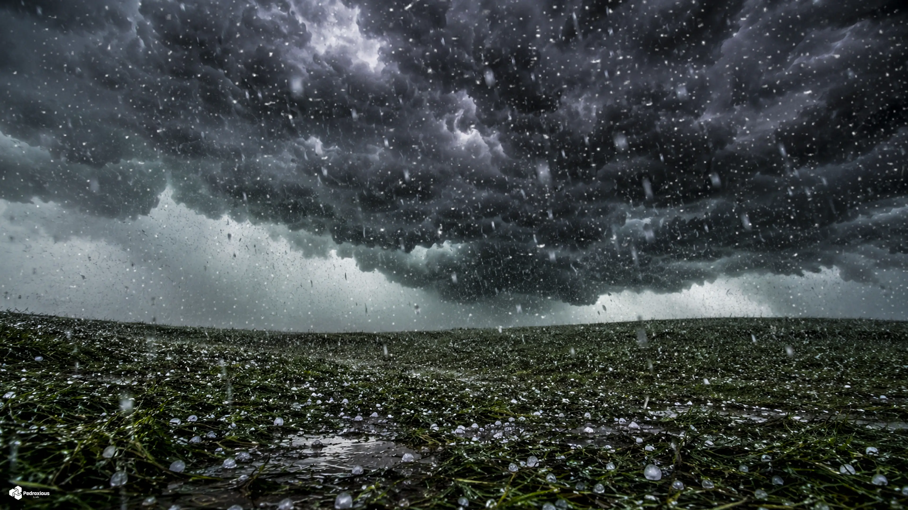

# SkyLog — Global Weather Dashboard

### Monitoramento climático em tempo real de 15 cidades ao redor do mundo

---

### Sync Ativo • Última atualização: 15:42 (BRT)
*Projeto em expansão, operando com automações no GitHub Actions para manter métricas globais atualizadas em tempo real. Consulte o link superior para a versão Web.*

 

## São Paulo, Brasil

<table>
  <tr>
    <td align="center" width="50%">
      
    </td>
    <td align="center" width="50%">
      
    </td>
  </tr>
</table>

| Parâmetro | Medição em Tempo Real |
|:---:|:---:|
| Temperatura | 21.8°C (Sensação: 20.9°C) |
| Variação Diária | 17.3°C — 23.7°C |
| Umidade / Pressão | 63% / 1009.8 hPa |
| Vento / Direção | 15.8 km/h (Direção: 317°) |
| UV / Visibilidade | 4.0 / 11.6 km |
| Condição Atual | Chuvisco |
| Horário Local | 15:41 |

### Previsão para os Próximos Dias

| Dia | Condição | Temperatura | Índice UV Máximo | Precipitação Prevista |
|:---:|:---:|:---:|:---:|:---:|
| Hoje | 🌧️ Chuva | 17.3°C a 23.7°C | UV: 5 | Precip: 4.4 mm |
| Amanhã | ⛈️ Tempestade | 15.7°C a 26.7°C | UV: 6 | Precip: 19.8 mm |
| 09/08 | 🌦️ Chuvisco | 15.6°C a 26.5°C | UV: 6 | Precip: 0.7 mm |

 
 

## Rio de Janeiro, Brasil

<table>
  <tr>
    <td align="center" width="50%">
      
    </td>
    <td align="center" width="50%">
      
    </td>
  </tr>
</table>

| Parâmetro | Medição em Tempo Real |
|:---:|:---:|
| Temperatura | 26.4°C (Sensação: 27.7°C) |
| Variação Diária | 23.5°C — 34.3°C |
| Umidade / Pressão | 65% / 1009.5 hPa |
| Vento / Direção | 14.9 km/h (Direção: 232°) |
| UV / Visibilidade | 3.2 / 34.0 km |
| Condição Atual | Nublado |
| Horário Local | 15:41 |

### Previsão para os Próximos Dias

| Dia | Condição | Temperatura | Índice UV Máximo | Precipitação Prevista |
|:---:|:---:|:---:|:---:|:---:|
| Hoje | 🌦️ Chuvisco | 23.5°C a 34.3°C | UV: 6 | Precip: 0.1 mm |
| Amanhã | 🌦️ Chuvisco | 21.2°C a 25.7°C | UV: 6 | Precip: 0.4 mm |
| 09/08 | 🌦️ Chuvisco | 22.3°C a 36.5°C | UV: 6 | Precip: 1.0 mm |

 
 

## Buenos Aires, Argentina

<table>
  <tr>
    <td align="center" width="50%">
      
    </td>
    <td align="center" width="50%">
      
    </td>
  </tr>
</table>

| Parâmetro | Medição em Tempo Real |
|:---:|:---:|
| Temperatura | 12.5°C (Sensação: 8.9°C) |
| Variação Diária | 4.8°C — 12.5°C |
| Umidade / Pressão | 49% / 1009.9 hPa |
| Vento / Direção | 11.9 km/h (Direção: 300°) |
| UV / Visibilidade | 3.7 / 56.5 km |
| Condição Atual | Céu limpo |
| Horário Local | 15:41 |

### Previsão para os Próximos Dias

| Dia | Condição | Temperatura | Índice UV Máximo | Precipitação Prevista |
|:---:|:---:|:---:|:---:|:---:|
| Hoje | ☀️ Céu limpo | 4.8°C a 12.5°C | UV: 4 | Precip: 0.0 mm |
| Amanhã | ☁️ Nublado | 7.4°C a 12.7°C | UV: 4 | Precip: 0.0 mm |
| 09/08 | ☀️ Céu limpo | 4.9°C a 13.0°C | UV: 4 | Precip: 0.0 mm |

 
 

## Mexico City, México

<table>
  <tr>
    <td align="center" width="50%">
      
    </td>
    <td align="center" width="50%">
      
    </td>
  </tr>
</table>

| Parâmetro | Medição em Tempo Real |
|:---:|:---:|
| Temperatura | 21.7°C (Sensação: 23.9°C) |
| Variação Diária | 13.2°C — 23.0°C |
| Umidade / Pressão | 48% / 1017.4 hPa |
| Vento / Direção | 1.3 km/h (Direção: 262°) |
| UV / Visibilidade | 8.8 / 11.9 km |
| Condição Atual | Parcialmente nublado |
| Horário Local | 12:41 |

### Previsão para os Próximos Dias

| Dia | Condição | Temperatura | Índice UV Máximo | Precipitação Prevista |
|:---:|:---:|:---:|:---:|:---:|
| Hoje | ⛈️ Tempestade | 13.2°C a 23.0°C | UV: 9 | Precip: 18.3 mm |
| Amanhã | ⛈️ Tempestade | 13.3°C a 23.1°C | UV: 9 | Precip: 9.4 mm |
| 09/08 | ⛈️ Tempestade | 13.0°C a 22.0°C | UV: 9 | Precip: 7.8 mm |

 
 

## Havana, Cuba

<table>
  <tr>
    <td align="center" width="50%">
      
    </td>
    <td align="center" width="50%">
      
    </td>
  </tr>
</table>

| Parâmetro | Medição em Tempo Real |
|:---:|:---:|
| Temperatura | 30.8°C (Sensação: 35.8°C) |
| Variação Diária | 24.8°C — 32.6°C |
| Umidade / Pressão | 66% / 1016.6 hPa |
| Vento / Direção | 13.7 km/h (Direção: 25°) |
| UV / Visibilidade | 8.8 / 24.6 km |
| Condição Atual | Granizo |
| Horário Local | 14:41 |

### Previsão para os Próximos Dias

| Dia | Condição | Temperatura | Índice UV Máximo | Precipitação Prevista |
|:---:|:---:|:---:|:---:|:---:|
| Hoje | 🌨️ Granizo | 24.8°C a 32.6°C | UV: 9 | Precip: 6.4 mm |
| Amanhã | ⛈️ Tempestade | 24.6°C a 32.8°C | UV: 8 | Precip: 3.5 mm |
| 09/08 | ⛈️ Tempestade | 24.5°C a 33.3°C | UV: 9 | Precip: 2.8 mm |

 
 

## Miami, EUA

<table>
  <tr>
    <td align="center" width="50%">
      
    </td>
    <td align="center" width="50%">
      
    </td>
  </tr>
</table>

| Parâmetro | Medição em Tempo Real |
|:---:|:---:|
| Temperatura | 30.2°C (Sensação: 35.8°C) |
| Variação Diária | 24.6°C — 30.8°C |
| Umidade / Pressão | 77% / 1016.7 hPa |
| Vento / Direção | 15.9 km/h (Direção: 128°) |
| UV / Visibilidade | 7.9 / 19.9 km |
| Condição Atual | Principalmente limpo |
| Horário Local | 14:41 |

### Previsão para os Próximos Dias

| Dia | Condição | Temperatura | Índice UV Máximo | Precipitação Prevista |
|:---:|:---:|:---:|:---:|:---:|
| Hoje | ☁️ Nublado | 24.6°C a 30.8°C | UV: 8 | Precip: 0.0 mm |
| Amanhã | ☁️ Nublado | 26.3°C a 30.8°C | UV: 9 | Precip: 0.0 mm |
| 09/08 | 🌦️ Chuvisco | 26.0°C a 31.5°C | UV: 9 | Precip: 0.2 mm |

 
 

## New York, EUA

<table>
  <tr>
    <td align="center" width="50%">
      
    </td>
    <td align="center" width="50%">
      
    </td>
  </tr>
</table>

| Parâmetro | Medição em Tempo Real |
|:---:|:---:|
| Temperatura | 34.7°C (Sensação: 37.8°C) |
| Variação Diária | 24.0°C — 34.7°C |
| Umidade / Pressão | 41% / 1017.6 hPa |
| Vento / Direção | 14.8 km/h (Direção: 181°) |
| UV / Visibilidade | 7.4 / 50.1 km |
| Condição Atual | Céu limpo |
| Horário Local | 14:41 |

### Previsão para os Próximos Dias

| Dia | Condição | Temperatura | Índice UV Máximo | Precipitação Prevista |
|:---:|:---:|:---:|:---:|:---:|
| Hoje | ⛈️ Tempestade | 24.0°C a 34.7°C | UV: 7 | Precip: 16.4 mm |
| Amanhã | ☁️ Nublado | 23.4°C a 33.0°C | UV: 7 | Precip: 0.0 mm |
| 09/08 | ☁️ Nublado | 22.7°C a 34.3°C | UV: 7 | Precip: 0.0 mm |

 
 

## London, Reino Unido

<table>
  <tr>
    <td align="center" width="50%">
      
    </td>
    <td align="center" width="50%">
      
    </td>
  </tr>
</table>

| Parâmetro | Medição em Tempo Real |
|:---:|:---:|
| Temperatura | 26.0°C (Sensação: 24.0°C) |
| Variação Diária | 14.1°C — 26.1°C |
| Umidade / Pressão | 25% / 1021.0 hPa |
| Vento / Direção | 5.0 km/h (Direção: 312°) |
| UV / Visibilidade | 0.1 / 25.7 km |
| Condição Atual | Céu limpo |
| Horário Local | 19:41 |

### Previsão para os Próximos Dias

| Dia | Condição | Temperatura | Índice UV Máximo | Precipitação Prevista |
|:---:|:---:|:---:|:---:|:---:|
| Hoje | ☁️ Nublado | 14.1°C a 26.1°C | UV: 6 | Precip: 0.0 mm |
| Amanhã | ☁️ Nublado | 17.0°C a 28.0°C | UV: 5 | Precip: 0.0 mm |
| 09/08 | ☁️ Nublado | 20.2°C a 33.0°C | UV: 5 | Precip: 0.0 mm |

 
 

## Paris, França

<table>
  <tr>
    <td align="center" width="50%">
      
    </td>
    <td align="center" width="50%">
      
    </td>
  </tr>
</table>

| Parâmetro | Medição em Tempo Real |
|:---:|:---:|
| Temperatura | 25.7°C (Sensação: 23.2°C) |
| Variação Diária | 14.6°C — 27.1°C |
| Umidade / Pressão | 30% / 1020.3 hPa |
| Vento / Direção | 11.1 km/h (Direção: 25°) |
| UV / Visibilidade | 1.2 / 46.8 km |
| Condição Atual | Céu limpo |
| Horário Local | 20:41 |

### Previsão para os Próximos Dias

| Dia | Condição | Temperatura | Índice UV Máximo | Precipitação Prevista |
|:---:|:---:|:---:|:---:|:---:|
| Hoje | ⛅ Parcialmente nublado | 14.6°C a 27.1°C | UV: 6 | Precip: 0.0 mm |
| Amanhã | ☁️ Nublado | 16.4°C a 30.8°C | UV: 7 | Precip: 0.0 mm |
| 09/08 | ☁️ Nublado | 21.5°C a 34.2°C | UV: 6 | Precip: 0.0 mm |

 
 

## Moscow, Rússia

<table>
  <tr>
    <td align="center" width="50%">
      
    </td>
    <td align="center" width="50%">
      
    </td>
  </tr>
</table>

| Parâmetro | Medição em Tempo Real |
|:---:|:---:|
| Temperatura | 23.7°C (Sensação: 26.3°C) |
| Variação Diária | 20.5°C — 30.5°C |
| Umidade / Pressão | 76% / 1011.0 hPa |
| Vento / Direção | 6.2 km/h (Direção: 277°) |
| UV / Visibilidade | 0.0 / 35.1 km |
| Condição Atual | Nublado |
| Horário Local | 21:41 |

### Previsão para os Próximos Dias

| Dia | Condição | Temperatura | Índice UV Máximo | Precipitação Prevista |
|:---:|:---:|:---:|:---:|:---:|
| Hoje | ☁️ Nublado | 20.5°C a 30.5°C | UV: 6 | Precip: 0.2 mm |
| Amanhã | 🌧️ Chuva | 18.6°C a 24.7°C | UV: 5 | Precip: 0.5 mm |
| 09/08 | ☁️ Nublado | 15.6°C a 22.0°C | UV: 5 | Precip: 0.0 mm |

 
 

## Histórico de Dados

| Estatística | Valor |
|:---:|:---:|
| Total de registros | 10493 |
| Primeiro registro | `datetime` |
| Último registro | `2026-08-07 21:41` |
| Temperatura mais alta | **45.1°C** — Dubai |
| Temperatura mais baixa | **0.7°C** — Buenos Aires |

📂 <a href="data/history.csv">Ver histórico completo (history.csv)</a>

---

### Informações Técnicas

| Item | Detalhe |
|:---:|:---:|
| Fonte de dados | <a href="https://open-meteo.com/">Open-Meteo API</a> (gratuita) |
| Frequência | 24× ao dia (a cada hora) |
| Automação | GitHub Actions — <a href=".github/workflows/weather.yml">ver workflow</a> |
| Script | `update_weather.py` (requests e pytz) |
| Cidades Monitoradas | 15 cidades globais |

---

**Feito com amor por [Pedroxious](https://github.com/Pedroxious) · Dados: [Open-Meteo](https://open-meteo.com/)**

