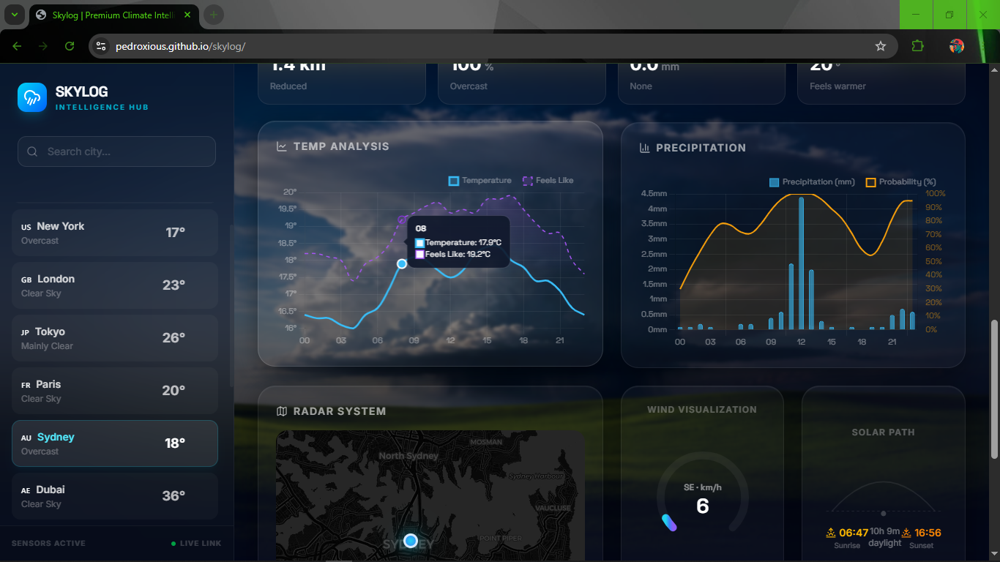

# SkyLog — Global Weather Dashboard

### Monitoramento climático em tempo real de 15 cidades ao redor do mundo

---

### Sync Ativo • Última atualização: 03:30 (BRT)
*Projeto em expansão, operando com automações no GitHub Actions para manter métricas globais atualizadas em tempo real. Consulte o link superior para a versão Web.*

 

## São Paulo, Brasil

<table>
  <tr>
    <td align="center" width="50%">
      
    </td>
    <td align="center" width="50%">
      
    </td>
  </tr>
</table>

| Parâmetro | Medição em Tempo Real |
|:---:|:---:|
| Temperatura | 18.7°C (Sensação: 19.1°C) |
| Variação Diária | 17.9°C — 31.5°C |
| Umidade / Pressão | 71% / 1018.0 hPa |
| Vento / Direção | 4.6 km/h (Direção: 108°) |
| UV / Visibilidade | 0.0 / 30.4 km |
| Condição Atual | Parcialmente nublado |
| Horário Local | 03:29 |

### Previsão para os Próximos Dias

| Dia | Condição | Temperatura | Índice UV Máximo | Precipitação Prevista |
|:---:|:---:|:---:|:---:|:---:|
| Hoje | ☁️ Nublado | 17.9°C a 31.5°C | UV: 7 | Precip: 0.0 mm |
| Amanhã | 🌦️ Chuvisco | 15.3°C a 25.1°C | UV: 6 | Precip: 0.1 mm |
| 22/08 | ☁️ Nublado | 12.0°C a 23.7°C | UV: 6 | Precip: 0.0 mm |

 
 

## Rio de Janeiro, Brasil

<table>
  <tr>
    <td align="center" width="50%">
      
    </td>
    <td align="center" width="50%">
      
    </td>
  </tr>
</table>

| Parâmetro | Medição em Tempo Real |
|:---:|:---:|
| Temperatura | 20.7°C (Sensação: 23.2°C) |
| Variação Diária | 20.2°C — 25.7°C |
| Umidade / Pressão | 83% / 1016.5 hPa |
| Vento / Direção | 2.3 km/h (Direção: 203°) |
| UV / Visibilidade | 0.0 / 10.5 km |
| Condição Atual | Principalmente limpo |
| Horário Local | 03:29 |

### Previsão para os Próximos Dias

| Dia | Condição | Temperatura | Índice UV Máximo | Precipitação Prevista |
|:---:|:---:|:---:|:---:|:---:|
| Hoje | ☁️ Nublado | 20.2°C a 25.7°C | UV: 7 | Precip: 0.0 mm |
| Amanhã | 🌦️ Chuvisco | 20.8°C a 32.8°C | UV: 7 | Precip: 1.0 mm |
| 22/08 | ☁️ Nublado | 19.9°C a 22.6°C | UV: 3 | Precip: 0.0 mm |

 
 

## Buenos Aires, Argentina

<table>
  <tr>
    <td align="center" width="50%">
      
    </td>
    <td align="center" width="50%">
      
    </td>
  </tr>
</table>

| Parâmetro | Medição em Tempo Real |
|:---:|:---:|
| Temperatura | 9.2°C (Sensação: 7.9°C) |
| Variação Diária | 7.4°C — 18.2°C |
| Umidade / Pressão | 91% / 1016.8 hPa |
| Vento / Direção | 4.5 km/h (Direção: 140°) |
| UV / Visibilidade | 0.0 / 14.0 km |
| Condição Atual | Nublado |
| Horário Local | 03:29 |

### Previsão para os Próximos Dias

| Dia | Condição | Temperatura | Índice UV Máximo | Precipitação Prevista |
|:---:|:---:|:---:|:---:|:---:|
| Hoje | ☁️ Nublado | 7.4°C a 18.2°C | UV: 4 | Precip: 0.0 mm |
| Amanhã | ☁️ Nublado | 6.9°C a 12.2°C | UV: 5 | Precip: 0.0 mm |
| 22/08 | ☁️ Nublado | 3.5°C a 12.5°C | UV: 5 | Precip: 0.0 mm |

 
 

## Mexico City, México

<table>
  <tr>
    <td align="center" width="50%">
      
    </td>
    <td align="center" width="50%">
      
    </td>
  </tr>
</table>

| Parâmetro | Medição em Tempo Real |
|:---:|:---:|
| Temperatura | 15.3°C (Sensação: 15.7°C) |
| Variação Diária | 13.7°C — 24.8°C |
| Umidade / Pressão | 88% / 1021.6 hPa |
| Vento / Direção | 4.0 km/h (Direção: 342°) |
| UV / Visibilidade | 0.0 / 21.7 km |
| Condição Atual | Nublado |
| Horário Local | 00:29 |

### Previsão para os Próximos Dias

| Dia | Condição | Temperatura | Índice UV Máximo | Precipitação Prevista |
|:---:|:---:|:---:|:---:|:---:|
| Hoje | 🌧️ Chuva | 13.7°C a 24.8°C | UV: 9 | Precip: 5.9 mm |
| Amanhã | ⛈️ Tempestade | 13.3°C a 25.0°C | UV: 10 | Precip: 13.2 mm |
| 22/08 | 🌦️ Chuvisco | 14.7°C a 23.1°C | UV: 7 | Precip: 3.3 mm |

 
 

## Havana, Cuba

<table>
  <tr>
    <td align="center" width="50%">
      
    </td>
    <td align="center" width="50%">
      
    </td>
  </tr>
</table>

| Parâmetro | Medição em Tempo Real |
|:---:|:---:|
| Temperatura | 26.9°C (Sensação: 32.5°C) |
| Variação Diária | 25.5°C — 32.8°C |
| Umidade / Pressão | 85% / 1016.4 hPa |
| Vento / Direção | 4.0 km/h (Direção: 63°) |
| UV / Visibilidade | 0.0 / 38.0 km |
| Condição Atual | Nublado |
| Horário Local | 02:29 |

### Previsão para os Próximos Dias

| Dia | Condição | Temperatura | Índice UV Máximo | Precipitação Prevista |
|:---:|:---:|:---:|:---:|:---:|
| Hoje | ⛈️ Tempestade | 25.5°C a 32.8°C | UV: 8 | Precip: 2.3 mm |
| Amanhã | ⛈️ Tempestade | 24.5°C a 32.8°C | UV: 8 | Precip: 1.4 mm |
| 22/08 | ⛈️ Tempestade | 25.1°C a 33.3°C | UV: 8 | Precip: 1.8 mm |

 
 

## Miami, EUA

<table>
  <tr>
    <td align="center" width="50%">
      
    </td>
    <td align="center" width="50%">
      
    </td>
  </tr>
</table>

| Parâmetro | Medição em Tempo Real |
|:---:|:---:|
| Temperatura | 25.5°C (Sensação: 30.2°C) |
| Variação Diária | 25.1°C — 33.8°C |
| Umidade / Pressão | 86% / 1015.2 hPa |
| Vento / Direção | 5.4 km/h (Direção: 307°) |
| UV / Visibilidade | 0.0 / 15.3 km |
| Condição Atual | Principalmente limpo |
| Horário Local | 02:29 |

### Previsão para os Próximos Dias

| Dia | Condição | Temperatura | Índice UV Máximo | Precipitação Prevista |
|:---:|:---:|:---:|:---:|:---:|
| Hoje | ⛈️ Tempestade | 25.1°C a 33.8°C | UV: 8 | Precip: 56.5 mm |
| Amanhã | 🌧️ Chuva | 26.0°C a 30.9°C | UV: 8 | Precip: 4.5 mm |
| 22/08 | ⛈️ Tempestade | 29.3°C a 32.1°C | UV: 9 | Precip: 3.9 mm |

 
 

## New York, EUA

<table>
  <tr>
    <td align="center" width="50%">
      
    </td>
    <td align="center" width="50%">
      
    </td>
  </tr>
</table>

| Parâmetro | Medição em Tempo Real |
|:---:|:---:|
| Temperatura | 21.7°C (Sensação: 23.7°C) |
| Variação Diária | 19.2°C — 30.0°C |
| Umidade / Pressão | 81% / 1012.9 hPa |
| Vento / Direção | 7.3 km/h (Direção: 279°) |
| UV / Visibilidade | 0.0 / 18.4 km |
| Condição Atual | Céu limpo |
| Horário Local | 02:29 |

### Previsão para os Próximos Dias

| Dia | Condição | Temperatura | Índice UV Máximo | Precipitação Prevista |
|:---:|:---:|:---:|:---:|:---:|
| Hoje | 🌧️ Chuva | 19.2°C a 30.0°C | UV: 6 | Precip: 34.2 mm |
| Amanhã | 🌧️ Chuva | 19.1°C a 24.3°C | UV: 7 | Precip: 2.5 mm |
| 22/08 | 🌧️ Chuva | 20.2°C a 24.1°C | UV: 3 | Precip: 8.3 mm |

 
 

## London, Reino Unido

<table>
  <tr>
    <td align="center" width="50%">
      
    </td>
    <td align="center" width="50%">
      
    </td>
  </tr>
</table>

| Parâmetro | Medição em Tempo Real |
|:---:|:---:|
| Temperatura | 16.6°C (Sensação: 15.4°C) |
| Variação Diária | 16.3°C — 21.5°C |
| Umidade / Pressão | 75% / 1004.3 hPa |
| Vento / Direção | 12.6 km/h (Direção: 240°) |
| UV / Visibilidade | 0.0 / 20.1 km |
| Condição Atual | Nublado |
| Horário Local | 07:29 |

### Previsão para os Próximos Dias

| Dia | Condição | Temperatura | Índice UV Máximo | Precipitação Prevista |
|:---:|:---:|:---:|:---:|:---:|
| Hoje | 🌦️ Chuvisco | 16.3°C a 21.5°C | UV: 4 | Precip: 1.4 mm |
| Amanhã | ☁️ Nublado | 14.7°C a 20.6°C | UV: 3 | Precip: 0.0 mm |
| 22/08 | ☁️ Nublado | 12.2°C a 20.9°C | UV: 6 | Precip: 0.0 mm |

 
 

## Paris, França

<table>
  <tr>
    <td align="center" width="50%">
      
    </td>
    <td align="center" width="50%">
      
    </td>
  </tr>
</table>

| Parâmetro | Medição em Tempo Real |
|:---:|:---:|
| Temperatura | 15.7°C (Sensação: 15.4°C) |
| Variação Diária | 15.6°C — 25.4°C |
| Umidade / Pressão | 84% / 1010.1 hPa |
| Vento / Direção | 8.1 km/h (Direção: 212°) |
| UV / Visibilidade | 0.2 / 25.8 km |
| Condição Atual | Céu limpo |
| Horário Local | 08:29 |

### Previsão para os Próximos Dias

| Dia | Condição | Temperatura | Índice UV Máximo | Precipitação Prevista |
|:---:|:---:|:---:|:---:|:---:|
| Hoje | ☁️ Nublado | 15.6°C a 25.4°C | UV: 6 | Precip: 0.0 mm |
| Amanhã | 🌨️ Granizo | 16.2°C a 24.1°C | UV: 6 | Precip: 5.5 mm |
| 22/08 | ☁️ Nublado | 12.4°C a 23.2°C | UV: 6 | Precip: 0.0 mm |

 
 

## Moscow, Rússia

<table>
  <tr>
    <td align="center" width="50%">
      
    </td>
    <td align="center" width="50%">
      
    </td>
  </tr>
</table>

| Parâmetro | Medição em Tempo Real |
|:---:|:---:|
| Temperatura | 17.5°C (Sensação: 17.0°C) |
| Variação Diária | 12.4°C — 21.5°C |
| Umidade / Pressão | 68% / 1012.1 hPa |
| Vento / Direção | 6.8 km/h (Direção: 205°) |
| UV / Visibilidade | 2.0 / 37.1 km |
| Condição Atual | Principalmente limpo |
| Horário Local | 09:29 |

### Previsão para os Próximos Dias

| Dia | Condição | Temperatura | Índice UV Máximo | Precipitação Prevista |
|:---:|:---:|:---:|:---:|:---:|
| Hoje | 🌧️ Chuva | 12.4°C a 21.5°C | UV: 5 | Precip: 1.8 mm |
| Amanhã | 🌧️ Chuva | 15.5°C a 21.7°C | UV: 3 | Precip: 6.4 mm |
| 22/08 | 🌧️ Chuva | 12.9°C a 23.4°C | UV: 5 | Precip: 0.1 mm |

 
 

## Bangkok, Tailândia

<table>
  <tr>
    <td align="center" width="50%">
      
    </td>
    <td align="center" width="50%">
      
    </td>
  </tr>
</table>

| Parâmetro | Medição em Tempo Real |
|:---:|:---:|
| Temperatura | 26.7°C (Sensação: 32.1°C) |
| Variação Diária | 25.2°C — 28.7°C |
| Umidade / Pressão | 89% / 1007.1 hPa |
| Vento / Direção | 8.0 km/h (Direção: 208°) |
| UV / Visibilidade | 0.8 / 3.1 km |
| Condição Atual | Chuvisco |
| Horário Local | 13:29 |

### Previsão para os Próximos Dias

| Dia | Condição | Temperatura | Índice UV Máximo | Precipitação Prevista |
|:---:|:---:|:---:|:---:|:---:|
| Hoje | ⛈️ Tempestade | 25.2°C a 28.7°C | UV: 1 | Precip: 9.0 mm |
| Amanhã | ⛈️ Tempestade | 25.2°C a 30.9°C | UV: 6 | Precip: 4.5 mm |
| 22/08 | ⛈️ Tempestade | 26.4°C a 31.1°C | UV: 2 | Precip: 8.1 mm |

 
 

## Tokyo, Japão

<table>
  <tr>
    <td align="center" width="50%">
      
    </td>
    <td align="center" width="50%">
      
    </td>
  </tr>
</table>

| Parâmetro | Medição em Tempo Real |
|:---:|:---:|
| Temperatura | 30.7°C (Sensação: 35.5°C) |
| Variação Diária | 23.2°C — 30.7°C |
| Umidade / Pressão | 63% / 1013.2 hPa |
| Vento / Direção | 4.1 km/h (Direção: 165°) |
| UV / Visibilidade | 4.0 / 27.3 km |
| Condição Atual | Parcialmente nublado |
| Horário Local | 15:29 |

### Previsão para os Próximos Dias

| Dia | Condição | Temperatura | Índice UV Máximo | Precipitação Prevista |
|:---:|:---:|:---:|:---:|:---:|
| Hoje | ⛅ Parcialmente nublado | 23.2°C a 30.7°C | UV: 7 | Precip: 0.0 mm |
| Amanhã | 🌦️ Chuvisco | 24.5°C a 29.7°C | UV: 6 | Precip: 0.1 mm |
| 22/08 | 🌦️ Chuvisco | 23.8°C a 30.2°C | UV: 5 | Precip: 0.3 mm |

 
 

## Histórico de Dados

| Estatística | Valor |
|:---:|:---:|
| Total de registros | 13471 |
| Primeiro registro | `datetime` |
| Último registro | `2026-08-20 15:29` |
| Temperatura mais alta | **46.1°C** — Dubai |
| Temperatura mais baixa | **0.7°C** — Buenos Aires |

📂 <a href="data/history.csv">Ver histórico completo (history.csv)</a>

---

### Informações Técnicas

| Item | Detalhe |
|:---:|:---:|
| Fonte de dados | <a href="https://open-meteo.com/">Open-Meteo API</a> (gratuita) |
| Frequência | 24× ao dia (a cada hora) |
| Automação | GitHub Actions — <a href=".github/workflows/weather.yml">ver workflow</a> |
| Script | `update_weather.py` (requests e pytz) |
| Cidades Monitoradas | 15 cidades globais |

---

**Feito com amor por [Pedroxious](https://github.com/Pedroxious) · Dados: [Open-Meteo](https://open-meteo.com/)**

