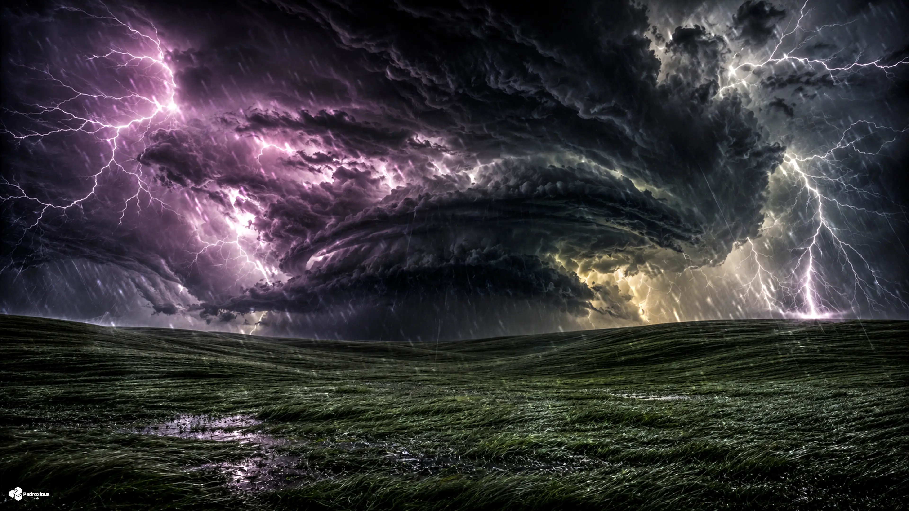

# SkyLog — Global Weather Dashboard

### Monitoramento climático em tempo real de 15 cidades ao redor do mundo

---

### Sync Ativo • Última atualização: 17:41 (BRT)
*Projeto em expansão, operando com automações no GitHub Actions para manter métricas globais atualizadas em tempo real. Consulte o link superior para a versão Web.*

 

## São Paulo, Brasil

<table>
  <tr>
    <td align="center" width="50%">
      
    </td>
    <td align="center" width="50%">
      
    </td>
  </tr>
</table>

| Parâmetro | Medição em Tempo Real |
|:---:|:---:|
| Temperatura | 20.1°C (Sensação: 22.7°C) |
| Variação Diária | 16.2°C — 23.6°C |
| Umidade / Pressão | 94% / 1016.5 hPa |
| Vento / Direção | 4.8 km/h (Direção: 338°) |
| UV / Visibilidade | 0.3 / 2.4 km |
| Condição Atual | Tempestade |
| Horário Local | 17:40 |

### Previsão para os Próximos Dias

| Dia | Condição | Temperatura | Índice UV Máximo | Precipitação Prevista |
|:---:|:---:|:---:|:---:|:---:|
| Hoje | ⛈️ Tempestade | 16.2°C a 23.6°C | UV: 6 | Precip: 22.9 mm |
| Amanhã | 🌦️ Chuvisco | 17.6°C a 26.6°C | UV: 7 | Precip: 4.0 mm |
| 08/10 | 🌦️ Chuvisco | 17.4°C a 29.3°C | UV: 9 | Precip: 0.3 mm |

 
 

## Rio de Janeiro, Brasil

<table>
  <tr>
    <td align="center" width="50%">
      
    </td>
    <td align="center" width="50%">
      
    </td>
  </tr>
</table>

| Parâmetro | Medição em Tempo Real |
|:---:|:---:|
| Temperatura | 22.6°C (Sensação: 26.1°C) |
| Variação Diária | 21.0°C — 25.5°C |
| Umidade / Pressão | 93% / 1016.0 hPa |
| Vento / Direção | 7.6 km/h (Direção: 128°) |
| UV / Visibilidade | 0.2 / 8.5 km |
| Condição Atual | Nublado |
| Horário Local | 17:40 |

### Previsão para os Próximos Dias

| Dia | Condição | Temperatura | Índice UV Máximo | Precipitação Prevista |
|:---:|:---:|:---:|:---:|:---:|
| Hoje | 🌦️ Chuvisco | 21.0°C a 25.5°C | UV: 6 | Precip: 2.8 mm |
| Amanhã | 🌦️ Chuvisco | 21.7°C a 27.4°C | UV: 6 | Precip: 2.5 mm |
| 08/10 | 🌦️ Chuvisco | 22.2°C a 25.6°C | UV: 7 | Precip: 0.5 mm |

 
 

## Buenos Aires, Argentina

<table>
  <tr>
    <td align="center" width="50%">
      
    </td>
    <td align="center" width="50%">
      
    </td>
  </tr>
</table>

| Parâmetro | Medição em Tempo Real |
|:---:|:---:|
| Temperatura | 18.5°C (Sensação: 16.8°C) |
| Variação Diária | 13.3°C — 19.9°C |
| Umidade / Pressão | 59% / 1013.5 hPa |
| Vento / Direção | 11.8 km/h (Direção: 118°) |
| UV / Visibilidade | 2.3 / 53.4 km |
| Condição Atual | Parcialmente nublado |
| Horário Local | 17:40 |

### Previsão para os Próximos Dias

| Dia | Condição | Temperatura | Índice UV Máximo | Precipitação Prevista |
|:---:|:---:|:---:|:---:|:---:|
| Hoje | ☁️ Nublado | 13.3°C a 19.9°C | UV: 6 | Precip: 0.0 mm |
| Amanhã | ⛈️ Tempestade | 15.1°C a 16.9°C | UV: 3 | Precip: 33.1 mm |
| 08/10 | 🌦️ Chuvisco | 13.8°C a 18.2°C | UV: 4 | Precip: 1.6 mm |

 
 

## Mexico City, México

<table>
  <tr>
    <td align="center" width="50%">
      
    </td>
    <td align="center" width="50%">
      
    </td>
  </tr>
</table>

| Parâmetro | Medição em Tempo Real |
|:---:|:---:|
| Temperatura | 22.3°C (Sensação: 23.3°C) |
| Variação Diária | 14.1°C — 22.3°C |
| Umidade / Pressão | 53% / 1011.0 hPa |
| Vento / Direção | 5.0 km/h (Direção: 345°) |
| UV / Visibilidade | 7.2 / 14.1 km |
| Condição Atual | Parcialmente nublado |
| Horário Local | 14:40 |

### Previsão para os Próximos Dias

| Dia | Condição | Temperatura | Índice UV Máximo | Precipitação Prevista |
|:---:|:---:|:---:|:---:|:---:|
| Hoje | ⛈️ Tempestade | 14.1°C a 22.3°C | UV: 7 | Precip: 15.9 mm |
| Amanhã | 🌦️ Chuvisco | 14.1°C a 21.3°C | UV: 9 | Precip: 5.5 mm |
| 08/10 | 🌧️ Chuva | 11.1°C a 22.5°C | UV: 8 | Precip: 4.6 mm |

 
 

## Havana, Cuba

<table>
  <tr>
    <td align="center" width="50%">
      
    </td>
    <td align="center" width="50%">
      
    </td>
  </tr>
</table>

| Parâmetro | Medição em Tempo Real |
|:---:|:---:|
| Temperatura | 30.5°C (Sensação: 36.1°C) |
| Variação Diária | 23.5°C — 31.4°C |
| Umidade / Pressão | 67% / 1009.7 hPa |
| Vento / Direção | 1.5 km/h (Direção: 330°) |
| UV / Visibilidade | 5.5 / 17.6 km |
| Condição Atual | Parcialmente nublado |
| Horário Local | 16:40 |

### Previsão para os Próximos Dias

| Dia | Condição | Temperatura | Índice UV Máximo | Precipitação Prevista |
|:---:|:---:|:---:|:---:|:---:|
| Hoje | ⛈️ Tempestade | 23.5°C a 31.4°C | UV: 8 | Precip: 6.4 mm |
| Amanhã | 🌨️ Granizo | 23.8°C a 31.2°C | UV: 8 | Precip: 11.4 mm |
| 08/10 | ⛈️ Tempestade | 23.5°C a 31.6°C | UV: 8 | Precip: 0.8 mm |

 
 

## Miami, EUA

<table>
  <tr>
    <td align="center" width="50%">
      
    </td>
    <td align="center" width="50%">
      
    </td>
  </tr>
</table>

| Parâmetro | Medição em Tempo Real |
|:---:|:---:|
| Temperatura | 29.0°C (Sensação: 32.9°C) |
| Variação Diária | 24.1°C — 30.4°C |
| Umidade / Pressão | 74% / 1011.1 hPa |
| Vento / Direção | 14.0 km/h (Direção: 149°) |
| UV / Visibilidade | 5.0 / 21.2 km |
| Condição Atual | Céu limpo |
| Horário Local | 16:40 |

### Previsão para os Próximos Dias

| Dia | Condição | Temperatura | Índice UV Máximo | Precipitação Prevista |
|:---:|:---:|:---:|:---:|:---:|
| Hoje | ☁️ Nublado | 24.1°C a 30.4°C | UV: 8 | Precip: 0.0 mm |
| Amanhã | ⛈️ Tempestade | 24.0°C a 29.4°C | UV: 7 | Precip: 28.5 mm |
| 08/10 | 🌦️ Chuvisco | 24.0°C a 30.5°C | UV: 7 | Precip: 1.8 mm |

 
 

## New York, EUA

<table>
  <tr>
    <td align="center" width="50%">
      
    </td>
    <td align="center" width="50%">
      
    </td>
  </tr>
</table>

| Parâmetro | Medição em Tempo Real |
|:---:|:---:|
| Temperatura | 17.0°C (Sensação: 12.4°C) |
| Variação Diária | 7.7°C — 17.7°C |
| Umidade / Pressão | 29% / 1017.8 hPa |
| Vento / Direção | 15.8 km/h (Direção: 306°) |
| UV / Visibilidade | 3.0 / 63.0 km |
| Condição Atual | Céu limpo |
| Horário Local | 16:40 |

### Previsão para os Próximos Dias

| Dia | Condição | Temperatura | Índice UV Máximo | Precipitação Prevista |
|:---:|:---:|:---:|:---:|:---:|
| Hoje | ☀️ Céu limpo | 7.7°C a 17.7°C | UV: 5 | Precip: 0.0 mm |
| Amanhã | ☀️ Céu limpo | 6.7°C a 19.1°C | UV: 5 | Precip: 0.0 mm |
| 08/10 | ☁️ Nublado | 12.6°C a 24.3°C | UV: 5 | Precip: 0.0 mm |

 
 

## London, Reino Unido

<table>
  <tr>
    <td align="center" width="50%">
      
    </td>
    <td align="center" width="50%">
      
    </td>
  </tr>
</table>

| Parâmetro | Medição em Tempo Real |
|:---:|:---:|
| Temperatura | 19.1°C (Sensação: 19.3°C) |
| Variação Diária | 13.6°C — 21.2°C |
| Umidade / Pressão | 74% / 1015.4 hPa |
| Vento / Direção | 8.3 km/h (Direção: 119°) |
| UV / Visibilidade | 0.0 / 18.9 km |
| Condição Atual | Céu limpo |
| Horário Local | 21:40 |

### Previsão para os Próximos Dias

| Dia | Condição | Temperatura | Índice UV Máximo | Precipitação Prevista |
|:---:|:---:|:---:|:---:|:---:|
| Hoje | ☁️ Nublado | 13.6°C a 21.2°C | UV: 2 | Precip: 0.0 mm |
| Amanhã | 🌧️ Chuva | 10.8°C a 18.0°C | UV: 1 | Precip: 12.5 mm |
| 08/10 | 🌦️ Chuvisco | 8.3°C a 14.8°C | UV: 2 | Precip: 0.0 mm |

 
 

## Paris, França

<table>
  <tr>
    <td align="center" width="50%">
      
    </td>
    <td align="center" width="50%">
      
    </td>
  </tr>
</table>

| Parâmetro | Medição em Tempo Real |
|:---:|:---:|
| Temperatura | 19.2°C (Sensação: 19.2°C) |
| Variação Diária | 11.0°C — 24.5°C |
| Umidade / Pressão | 59% / 1013.5 hPa |
| Vento / Direção | 2.1 km/h (Direção: 31°) |
| UV / Visibilidade | 0.0 / 42.0 km |
| Condição Atual | Parcialmente nublado |
| Horário Local | 22:40 |

### Previsão para os Próximos Dias

| Dia | Condição | Temperatura | Índice UV Máximo | Precipitação Prevista |
|:---:|:---:|:---:|:---:|:---:|
| Hoje | ☁️ Nublado | 11.0°C a 24.5°C | UV: 4 | Precip: 0.0 mm |
| Amanhã | 🌧️ Chuva | 13.7°C a 23.4°C | UV: 3 | Precip: 8.7 mm |
| 08/10 | 🌧️ Chuva | 9.3°C a 15.8°C | UV: 4 | Precip: 0.5 mm |

 
 

## Moscow, Rússia

<table>
  <tr>
    <td align="center" width="50%">
      
    </td>
    <td align="center" width="50%">
      
    </td>
  </tr>
</table>

| Parâmetro | Medição em Tempo Real |
|:---:|:---:|
| Temperatura | 12.4°C (Sensação: 10.7°C) |
| Variação Diária | 8.9°C — 12.6°C |
| Umidade / Pressão | 86% / 1006.4 hPa |
| Vento / Direção | 11.5 km/h (Direção: 268°) |
| UV / Visibilidade | 0.0 / 27.0 km |
| Condição Atual | Nublado |
| Horário Local | 23:40 |

### Previsão para os Próximos Dias

| Dia | Condição | Temperatura | Índice UV Máximo | Precipitação Prevista |
|:---:|:---:|:---:|:---:|:---:|
| Hoje | 🌧️ Chuva | 8.9°C a 12.6°C | UV: 1 | Precip: 1.0 mm |
| Amanhã | ☁️ Nublado | 8.7°C a 15.5°C | UV: 3 | Precip: 0.0 mm |
| 08/10 | 🌧️ Chuva | 6.5°C a 13.8°C | UV: 2 | Precip: 0.1 mm |

 
 

## Histórico de Dados

| Estatística | Valor |
|:---:|:---:|
| Total de registros | 17933 |
| Primeiro registro | `datetime` |
| Último registro | `2026-10-06 23:40` |
| Temperatura mais alta | **46.1°C** — Dubai |
| Temperatura mais baixa | **0.7°C** — Buenos Aires |

📂 <a href="data/history.csv">Ver histórico completo (history.csv)</a>

---

### Informações Técnicas

| Item | Detalhe |
|:---:|:---:|
| Fonte de dados | <a href="https://open-meteo.com/">Open-Meteo API</a> (gratuita) |
| Frequência | 24× ao dia (a cada hora) |
| Automação | GitHub Actions — <a href=".github/workflows/weather.yml">ver workflow</a> |
| Script | `update_weather.py` (requests e pytz) |
| Cidades Monitoradas | 15 cidades globais |

---

**Feito com amor por [Pedroxious](https://github.com/Pedroxious) · Dados: [Open-Meteo](https://open-meteo.com/)**

