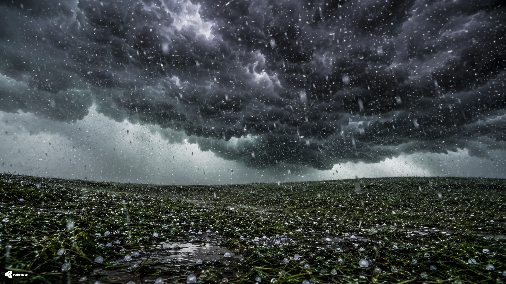

# SkyLog — Global Weather Dashboard

### Monitoramento climático em tempo real de 15 cidades ao redor do mundo

---

### Sync Ativo • Última atualização: 15:27 (BRT)
*Projeto em expansão, operando com automações no GitHub Actions para manter métricas globais atualizadas em tempo real. Consulte o link superior para a versão Web.*

 

## São Paulo, Brasil

<table>
  <tr>
    <td align="center" width="50%">
      
    </td>
    <td align="center" width="50%">
      
    </td>
  </tr>
</table>

| Parâmetro | Medição em Tempo Real |
|:---:|:---:|
| Temperatura | 20.7°C (Sensação: 22.0°C) |
| Variação Diária | 14.8°C — 24.6°C |
| Umidade / Pressão | 81% / 1013.7 hPa |
| Vento / Direção | 8.5 km/h (Direção: 5°) |
| UV / Visibilidade | 0.6 / 3.8 km |
| Condição Atual | Chuvisco |
| Horário Local | 15:26 |

### Previsão para os Próximos Dias

| Dia | Condição | Temperatura | Índice UV Máximo | Precipitação Prevista |
|:---:|:---:|:---:|:---:|:---:|
| Hoje | ⛈️ Tempestade | 14.8°C a 24.6°C | UV: 7 | Precip: 4.7 mm |
| Amanhã | ⛈️ Tempestade | 16.8°C a 24.6°C | UV: 9 | Precip: 6.4 mm |
| 05/10 | 🌦️ Chuvisco | 18.0°C a 26.8°C | UV: 5 | Precip: 1.8 mm |

 
 

## Rio de Janeiro, Brasil

<table>
  <tr>
    <td align="center" width="50%">
      
    </td>
    <td align="center" width="50%">
      
    </td>
  </tr>
</table>

| Parâmetro | Medição em Tempo Real |
|:---:|:---:|
| Temperatura | 20.8°C (Sensação: 22.3°C) |
| Variação Diária | 19.6°C — 20.9°C |
| Umidade / Pressão | 95% / 1016.0 hPa |
| Vento / Direção | 16.6 km/h (Direção: 90°) |
| UV / Visibilidade | 0.8 / 5.2 km |
| Condição Atual | Chuvisco |
| Horário Local | 15:26 |

### Previsão para os Próximos Dias

| Dia | Condição | Temperatura | Índice UV Máximo | Precipitação Prevista |
|:---:|:---:|:---:|:---:|:---:|
| Hoje | 🌧️ Chuva | 19.6°C a 20.9°C | UV: 1 | Precip: 19.9 mm |
| Amanhã | 🌦️ Chuvisco | 20.7°C a 27.2°C | UV: 9 | Precip: 1.8 mm |
| 05/10 | 🌦️ Chuvisco | 22.6°C a 29.6°C | UV: 8 | Precip: 3.6 mm |

 
 

## Buenos Aires, Argentina

<table>
  <tr>
    <td align="center" width="50%">
      
    </td>
    <td align="center" width="50%">
      
    </td>
  </tr>
</table>

| Parâmetro | Medição em Tempo Real |
|:---:|:---:|
| Temperatura | 15.6°C (Sensação: 15.3°C) |
| Variação Diária | 12.7°C — 15.6°C |
| Umidade / Pressão | 76% / 1009.4 hPa |
| Vento / Direção | 5.3 km/h (Direção: 336°) |
| UV / Visibilidade | 2.2 / 46.5 km |
| Condição Atual | Nublado |
| Horário Local | 15:26 |

### Previsão para os Próximos Dias

| Dia | Condição | Temperatura | Índice UV Máximo | Precipitação Prevista |
|:---:|:---:|:---:|:---:|:---:|
| Hoje | ⛈️ Tempestade | 12.7°C a 15.6°C | UV: 3 | Precip: 8.2 mm |
| Amanhã | ⛅ Parcialmente nublado | 11.1°C a 21.2°C | UV: 7 | Precip: 0.0 mm |
| 05/10 | ☁️ Nublado | 13.8°C a 19.5°C | UV: 6 | Precip: 0.0 mm |

 
 

## Mexico City, México

<table>
  <tr>
    <td align="center" width="50%">
      
    </td>
    <td align="center" width="50%">
      
    </td>
  </tr>
</table>

| Parâmetro | Medição em Tempo Real |
|:---:|:---:|
| Temperatura | 21.3°C (Sensação: 24.1°C) |
| Variação Diária | 13.8°C — 22.9°C |
| Umidade / Pressão | 57% / 1013.7 hPa |
| Vento / Direção | 3.1 km/h (Direção: 13°) |
| UV / Visibilidade | 8.4 / 11.0 km |
| Condição Atual | Chuvisco |
| Horário Local | 12:26 |

### Previsão para os Próximos Dias

| Dia | Condição | Temperatura | Índice UV Máximo | Precipitação Prevista |
|:---:|:---:|:---:|:---:|:---:|
| Hoje | ⛈️ Tempestade | 13.8°C a 22.9°C | UV: 9 | Precip: 20.3 mm |
| Amanhã | ⛈️ Tempestade | 14.5°C a 20.0°C | UV: 7 | Precip: 13.7 mm |
| 05/10 | ⛈️ Tempestade | 14.2°C a 21.6°C | UV: 7 | Precip: 17.0 mm |

 
 

## Havana, Cuba

<table>
  <tr>
    <td align="center" width="50%">
      
    </td>
    <td align="center" width="50%">
      
    </td>
  </tr>
</table>

| Parâmetro | Medição em Tempo Real |
|:---:|:---:|
| Temperatura | 31.4°C (Sensação: 37.2°C) |
| Variação Diária | 24.5°C — 32.0°C |
| Umidade / Pressão | 66% / 1013.4 hPa |
| Vento / Direção | 10.7 km/h (Direção: 147°) |
| UV / Visibilidade | 7.5 / 7.7 km |
| Condição Atual | Granizo |
| Horário Local | 14:26 |

### Previsão para os Próximos Dias

| Dia | Condição | Temperatura | Índice UV Máximo | Precipitação Prevista |
|:---:|:---:|:---:|:---:|:---:|
| Hoje | 🌨️ Granizo | 24.5°C a 32.0°C | UV: 7 | Precip: 5.8 mm |
| Amanhã | ⛈️ Tempestade | 24.0°C a 32.5°C | UV: 8 | Precip: 2.5 mm |
| 05/10 | 🌨️ Granizo | 24.5°C a 32.0°C | UV: 8 | Precip: 3.5 mm |

 
 

## Miami, EUA

<table>
  <tr>
    <td align="center" width="50%">
      
    </td>
    <td align="center" width="50%">
      
    </td>
  </tr>
</table>

| Parâmetro | Medição em Tempo Real |
|:---:|:---:|
| Temperatura | 29.1°C (Sensação: 34.5°C) |
| Variação Diária | 26.3°C — 29.7°C |
| Umidade / Pressão | 82% / 1015.7 hPa |
| Vento / Direção | 12.9 km/h (Direção: 124°) |
| UV / Visibilidade | 5.0 / 18.0 km |
| Condição Atual | Nublado |
| Horário Local | 14:26 |

### Previsão para os Próximos Dias

| Dia | Condição | Temperatura | Índice UV Máximo | Precipitação Prevista |
|:---:|:---:|:---:|:---:|:---:|
| Hoje | ☁️ Nublado | 26.3°C a 29.7°C | UV: 5 | Precip: 0.0 mm |
| Amanhã | ☁️ Nublado | 25.1°C a 29.2°C | UV: 8 | Precip: 0.0 mm |
| 05/10 | 🌦️ Chuvisco | 24.1°C a 30.1°C | UV: 7 | Precip: 2.5 mm |

 
 

## New York, EUA

<table>
  <tr>
    <td align="center" width="50%">
      
    </td>
    <td align="center" width="50%">
      
    </td>
  </tr>
</table>

| Parâmetro | Medição em Tempo Real |
|:---:|:---:|
| Temperatura | 22.7°C (Sensação: 19.6°C) |
| Variação Diária | 14.4°C — 22.7°C |
| Umidade / Pressão | 35% / 1023.7 hPa |
| Vento / Direção | 18.7 km/h (Direção: 54°) |
| UV / Visibilidade | 5.2 / 53.7 km |
| Condição Atual | Céu limpo |
| Horário Local | 14:26 |

### Previsão para os Próximos Dias

| Dia | Condição | Temperatura | Índice UV Máximo | Precipitação Prevista |
|:---:|:---:|:---:|:---:|:---:|
| Hoje | ☁️ Nublado | 14.4°C a 22.7°C | UV: 5 | Precip: 0.0 mm |
| Amanhã | 🌦️ Chuvisco | 12.5°C a 15.7°C | UV: 1 | Precip: 1.1 mm |
| 05/10 | ☁️ Nublado | 11.6°C a 19.9°C | UV: 5 | Precip: 0.0 mm |

 
 

## London, Reino Unido

<table>
  <tr>
    <td align="center" width="50%">
      
    </td>
    <td align="center" width="50%">
      
    </td>
  </tr>
</table>

| Parâmetro | Medição em Tempo Real |
|:---:|:---:|
| Temperatura | 19.4°C (Sensação: 19.7°C) |
| Variação Diária | 12.7°C — 19.9°C |
| Umidade / Pressão | 66% / 1030.1 hPa |
| Vento / Direção | 4.3 km/h (Direção: 14°) |
| UV / Visibilidade | 0.0 / 14.6 km |
| Condição Atual | Chuvisco |
| Horário Local | 19:26 |

### Previsão para os Próximos Dias

| Dia | Condição | Temperatura | Índice UV Máximo | Precipitação Prevista |
|:---:|:---:|:---:|:---:|:---:|
| Hoje | 🌦️ Chuvisco | 12.7°C a 19.9°C | UV: 2 | Precip: 0.2 mm |
| Amanhã | ⛅ Parcialmente nublado | 14.7°C a 22.4°C | UV: 2 | Precip: 0.0 mm |
| 05/10 | 🌤️ Principalmente limpo | 13.2°C a 22.6°C | UV: 2 | Precip: 0.0 mm |

 
 

## Paris, França

<table>
  <tr>
    <td align="center" width="50%">
      
    </td>
    <td align="center" width="50%">
      
    </td>
  </tr>
</table>

| Parâmetro | Medição em Tempo Real |
|:---:|:---:|
| Temperatura | 19.5°C (Sensação: 18.3°C) |
| Variação Diária | 11.5°C — 22.8°C |
| Umidade / Pressão | 50% / 1028.3 hPa |
| Vento / Direção | 6.0 km/h (Direção: 33°) |
| UV / Visibilidade | 0.0 / 41.5 km |
| Condição Atual | Chuva |
| Horário Local | 20:26 |

### Previsão para os Próximos Dias

| Dia | Condição | Temperatura | Índice UV Máximo | Precipitação Prevista |
|:---:|:---:|:---:|:---:|:---:|
| Hoje | 🌧️ Chuva | 11.5°C a 22.8°C | UV: 4 | Precip: 0.6 mm |
| Amanhã | ☁️ Nublado | 13.1°C a 24.5°C | UV: 4 | Precip: 0.0 mm |
| 05/10 | ☁️ Nublado | 14.1°C a 25.4°C | UV: 4 | Precip: 0.0 mm |

 
 

## Moscow, Rússia

<table>
  <tr>
    <td align="center" width="50%">
      
    </td>
    <td align="center" width="50%">
      
    </td>
  </tr>
</table>

| Parâmetro | Medição em Tempo Real |
|:---:|:---:|
| Temperatura | 5.3°C (Sensação: 2.7°C) |
| Variação Diária | 4.4°C — 10.6°C |
| Umidade / Pressão | 75% / 1027.7 hPa |
| Vento / Direção | 5.0 km/h (Direção: 30°) |
| UV / Visibilidade | 0.0 / 34.7 km |
| Condição Atual | Nublado |
| Horário Local | 21:26 |

### Previsão para os Próximos Dias

| Dia | Condição | Temperatura | Índice UV Máximo | Precipitação Prevista |
|:---:|:---:|:---:|:---:|:---:|
| Hoje | ☁️ Nublado | 4.4°C a 10.6°C | UV: 3 | Precip: 0.0 mm |
| Amanhã | ☁️ Nublado | 1.7°C a 11.6°C | UV: 3 | Precip: 0.0 mm |
| 05/10 | 🌧️ Chuva | 8.0°C a 13.4°C | UV: 2 | Precip: 0.1 mm |

 
 

## Histórico de Dados

| Estatística | Valor |
|:---:|:---:|
| Total de registros | 17782 |
| Primeiro registro | `datetime` |
| Último registro | `2026-10-03 21:26` |
| Temperatura mais alta | **46.1°C** — Dubai |
| Temperatura mais baixa | **0.7°C** — Buenos Aires |

📂 <a href="data/history.csv">Ver histórico completo (history.csv)</a>

---

### Informações Técnicas

| Item | Detalhe |
|:---:|:---:|
| Fonte de dados | <a href="https://open-meteo.com/">Open-Meteo API</a> (gratuita) |
| Frequência | 24× ao dia (a cada hora) |
| Automação | GitHub Actions — <a href=".github/workflows/weather.yml">ver workflow</a> |
| Script | `update_weather.py` (requests e pytz) |
| Cidades Monitoradas | 15 cidades globais |

---

**Feito com amor por [Pedroxious](https://github.com/Pedroxious) · Dados: [Open-Meteo](https://open-meteo.com/)**

