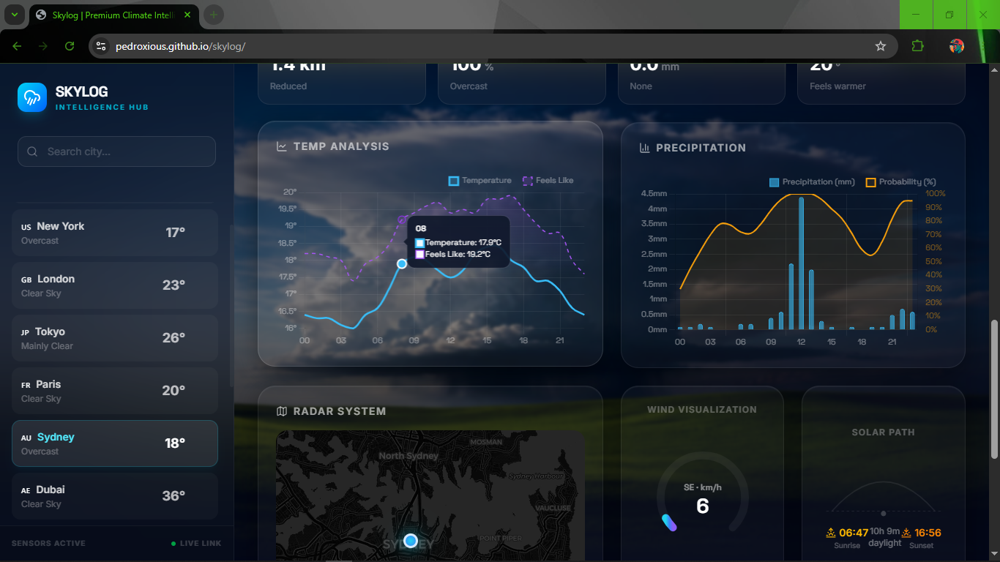

# SkyLog — Global Weather Dashboard

### Monitoramento climático em tempo real de 15 cidades ao redor do mundo

---

### Sync Ativo • Última atualização: 16:00 (BRT)
*Projeto em expansão, operando com automações no GitHub Actions para manter métricas globais atualizadas em tempo real. Consulte o link superior para a versão Web.*

 

## São Paulo, Brasil

<table>
  <tr>
    <td align="center" width="50%">
      
    </td>
    <td align="center" width="50%">
      
    </td>
  </tr>
</table>

| Parâmetro | Medição em Tempo Real |
|:---:|:---:|
| Temperatura | 25.6°C (Sensação: 26.9°C) |
| Variação Diária | 18.4°C — 33.3°C |
| Umidade / Pressão | 60% / 1009.6 hPa |
| Vento / Direção | 8.6 km/h (Direção: 329°) |
| UV / Visibilidade | 1.1 / 7.9 km |
| Condição Atual | Chuvisco |
| Horário Local | 15:59 |

### Previsão para os Próximos Dias

| Dia | Condição | Temperatura | Índice UV Máximo | Precipitação Prevista |
|:---:|:---:|:---:|:---:|:---:|
| Hoje | ⛈️ Tempestade | 18.4°C a 33.3°C | UV: 8 | Precip: 5.7 mm |
| Amanhã | 🌨️ Granizo | 20.3°C a 30.9°C | UV: 7 | Precip: 10.1 mm |
| 01/10 | ⛈️ Tempestade | 17.6°C a 28.2°C | UV: 7 | Precip: 12.2 mm |

 
 

## Rio de Janeiro, Brasil

<table>
  <tr>
    <td align="center" width="50%">
      
    </td>
    <td align="center" width="50%">
      
    </td>
  </tr>
</table>

| Parâmetro | Medição em Tempo Real |
|:---:|:---:|
| Temperatura | 27.7°C (Sensação: 30.9°C) |
| Variação Diária | 21.8°C — 27.9°C |
| Umidade / Pressão | 73% / 1008.0 hPa |
| Vento / Direção | 13.4 km/h (Direção: 117°) |
| UV / Visibilidade | 5.5 / 27.3 km |
| Condição Atual | Parcialmente nublado |
| Horário Local | 15:59 |

### Previsão para os Próximos Dias

| Dia | Condição | Temperatura | Índice UV Máximo | Precipitação Prevista |
|:---:|:---:|:---:|:---:|:---:|
| Hoje | ☁️ Nublado | 21.8°C a 27.9°C | UV: 8 | Precip: 0.0 mm |
| Amanhã | ☁️ Nublado | 23.3°C a 32.5°C | UV: 8 | Precip: 0.0 mm |
| 01/10 | ⛈️ Tempestade | 22.2°C a 30.3°C | UV: 5 | Precip: 19.2 mm |

 
 

## Buenos Aires, Argentina

<table>
  <tr>
    <td align="center" width="50%">
      
    </td>
    <td align="center" width="50%">
      
    </td>
  </tr>
</table>

| Parâmetro | Medição em Tempo Real |
|:---:|:---:|
| Temperatura | 20.2°C (Sensação: 17.5°C) |
| Variação Diária | 14.2°C — 20.4°C |
| Umidade / Pressão | 57% / 1009.0 hPa |
| Vento / Direção | 21.3 km/h (Direção: 207°) |
| UV / Visibilidade | 4.3 / 53.2 km |
| Condição Atual | Nublado |
| Horário Local | 15:59 |

### Previsão para os Próximos Dias

| Dia | Condição | Temperatura | Índice UV Máximo | Precipitação Prevista |
|:---:|:---:|:---:|:---:|:---:|
| Hoje | ⛈️ Tempestade | 14.2°C a 20.4°C | UV: 5 | Precip: 19.2 mm |
| Amanhã | ☁️ Nublado | 9.1°C a 17.9°C | UV: 7 | Precip: 0.0 mm |
| 01/10 | 🌦️ Chuvisco | 10.3°C a 15.5°C | UV: 7 | Precip: 0.2 mm |

 
 

## Mexico City, México

<table>
  <tr>
    <td align="center" width="50%">
      
    </td>
    <td align="center" width="50%">
      
    </td>
  </tr>
</table>

| Parâmetro | Medição em Tempo Real |
|:---:|:---:|
| Temperatura | 26.0°C (Sensação: 27.9°C) |
| Variação Diária | 14.1°C — 26.2°C |
| Umidade / Pressão | 40% / 1010.8 hPa |
| Vento / Direção | 4.8 km/h (Direção: 127°) |
| UV / Visibilidade | 8.6 / 23.3 km |
| Condição Atual | Nublado |
| Horário Local | 12:59 |

### Previsão para os Próximos Dias

| Dia | Condição | Temperatura | Índice UV Máximo | Precipitação Prevista |
|:---:|:---:|:---:|:---:|:---:|
| Hoje | 🌦️ Chuvisco | 14.1°C a 26.2°C | UV: 9 | Precip: 5.2 mm |
| Amanhã | ⛈️ Tempestade | 15.1°C a 24.5°C | UV: 9 | Precip: 11.0 mm |
| 01/10 | ⛈️ Tempestade | 14.5°C a 24.1°C | UV: 6 | Precip: 9.8 mm |

 
 

## Havana, Cuba

<table>
  <tr>
    <td align="center" width="50%">
      
    </td>
    <td align="center" width="50%">
      
    </td>
  </tr>
</table>

| Parâmetro | Medição em Tempo Real |
|:---:|:---:|
| Temperatura | 25.2°C (Sensação: 29.7°C) |
| Variação Diária | 23.1°C — 29.2°C |
| Umidade / Pressão | 85% / 1015.4 hPa |
| Vento / Direção | 4.3 km/h (Direção: 180°) |
| UV / Visibilidade | 1.8 / 3.3 km |
| Condição Atual | Chuva |
| Horário Local | 14:59 |

### Previsão para os Próximos Dias

| Dia | Condição | Temperatura | Índice UV Máximo | Precipitação Prevista |
|:---:|:---:|:---:|:---:|:---:|
| Hoje | ⛈️ Tempestade | 23.1°C a 29.2°C | UV: 3 | Precip: 7.5 mm |
| Amanhã | 🌨️ Granizo | 23.7°C a 28.4°C | UV: 4 | Precip: 11.8 mm |
| 01/10 | 🌨️ Granizo | 23.6°C a 31.3°C | UV: 8 | Precip: 6.4 mm |

 
 

## Miami, EUA

<table>
  <tr>
    <td align="center" width="50%">
      
    </td>
    <td align="center" width="50%">
      
    </td>
  </tr>
</table>

| Parâmetro | Medição em Tempo Real |
|:---:|:---:|
| Temperatura | 27.0°C (Sensação: 30.1°C) |
| Variação Diária | 21.3°C — 27.2°C |
| Umidade / Pressão | 73% / 1014.3 hPa |
| Vento / Direção | 10.9 km/h (Direção: 171°) |
| UV / Visibilidade | 0.5 / 24.0 km |
| Condição Atual | Nublado |
| Horário Local | 14:59 |

### Previsão para os Próximos Dias

| Dia | Condição | Temperatura | Índice UV Máximo | Precipitação Prevista |
|:---:|:---:|:---:|:---:|:---:|
| Hoje | ⛈️ Tempestade | 21.3°C a 27.2°C | UV: 4 | Precip: 43.7 mm |
| Amanhã | ⛈️ Tempestade | 21.8°C a 24.7°C | UV: 1 | Precip: 77.4 mm |
| 01/10 | 🌨️ Granizo | 23.3°C a 30.4°C | UV: 6 | Precip: 50.9 mm |

 
 

## New York, EUA

<table>
  <tr>
    <td align="center" width="50%">
      
    </td>
    <td align="center" width="50%">
      
    </td>
  </tr>
</table>

| Parâmetro | Medição em Tempo Real |
|:---:|:---:|
| Temperatura | 19.6°C (Sensação: 21.7°C) |
| Variação Diária | 14.8°C — 20.9°C |
| Umidade / Pressão | 83% / 1014.8 hPa |
| Vento / Direção | 1.8 km/h (Direção: 217°) |
| UV / Visibilidade | 3.0 / 18.0 km |
| Condição Atual | Nublado |
| Horário Local | 14:59 |

### Previsão para os Próximos Dias

| Dia | Condição | Temperatura | Índice UV Máximo | Precipitação Prevista |
|:---:|:---:|:---:|:---:|:---:|
| Hoje | ☁️ Nublado | 14.8°C a 20.9°C | UV: 4 | Precip: 0.0 mm |
| Amanhã | 🌫️ Neblina | 13.4°C a 21.1°C | UV: 6 | Precip: 0.0 mm |
| 01/10 | ☁️ Nublado | 16.4°C a 24.4°C | UV: 5 | Precip: 0.0 mm |

 
 

## London, Reino Unido

<table>
  <tr>
    <td align="center" width="50%">
      
    </td>
    <td align="center" width="50%">
      
    </td>
  </tr>
</table>

| Parâmetro | Medição em Tempo Real |
|:---:|:---:|
| Temperatura | 22.5°C (Sensação: 23.5°C) |
| Variação Diária | 16.4°C — 25.5°C |
| Umidade / Pressão | 73% / 1011.7 hPa |
| Vento / Direção | 11.2 km/h (Direção: 135°) |
| UV / Visibilidade | 0.0 / 18.8 km |
| Condição Atual | Principalmente limpo |
| Horário Local | 19:59 |

### Previsão para os Próximos Dias

| Dia | Condição | Temperatura | Índice UV Máximo | Precipitação Prevista |
|:---:|:---:|:---:|:---:|:---:|
| Hoje | 🌦️ Chuvisco | 16.4°C a 25.5°C | UV: 3 | Precip: 0.1 mm |
| Amanhã | 🌦️ Chuvisco | 18.1°C a 23.8°C | UV: 3 | Precip: 0.3 mm |
| 01/10 | 🌦️ Chuvisco | 14.3°C a 19.8°C | UV: 2 | Precip: 0.1 mm |

 
 

## Paris, França

<table>
  <tr>
    <td align="center" width="50%">
      
    </td>
    <td align="center" width="50%">
      
    </td>
  </tr>
</table>

| Parâmetro | Medição em Tempo Real |
|:---:|:---:|
| Temperatura | 25.5°C (Sensação: 25.0°C) |
| Variação Diária | 17.0°C — 28.3°C |
| Umidade / Pressão | 45% / 1014.0 hPa |
| Vento / Direção | 9.6 km/h (Direção: 124°) |
| UV / Visibilidade | 0.0 / 42.2 km |
| Condição Atual | Nublado |
| Horário Local | 20:59 |

### Previsão para os Próximos Dias

| Dia | Condição | Temperatura | Índice UV Máximo | Precipitação Prevista |
|:---:|:---:|:---:|:---:|:---:|
| Hoje | ☁️ Nublado | 17.0°C a 28.3°C | UV: 4 | Precip: 0.0 mm |
| Amanhã | 🌨️ Granizo | 18.7°C a 23.3°C | UV: 1 | Precip: 17.9 mm |
| 01/10 | ☁️ Nublado | 15.3°C a 20.6°C | UV: 4 | Precip: 0.0 mm |

 
 

## Moscow, Rússia

<table>
  <tr>
    <td align="center" width="50%">
      
    </td>
    <td align="center" width="50%">
      
    </td>
  </tr>
</table>

| Parâmetro | Medição em Tempo Real |
|:---:|:---:|
| Temperatura | 10.3°C (Sensação: 9.0°C) |
| Variação Diária | 5.3°C — 15.5°C |
| Umidade / Pressão | 74% / 1033.3 hPa |
| Vento / Direção | 2.5 km/h (Direção: 315°) |
| UV / Visibilidade | 0.0 / 38.8 km |
| Condição Atual | Nublado |
| Horário Local | 21:59 |

### Previsão para os Próximos Dias

| Dia | Condição | Temperatura | Índice UV Máximo | Precipitação Prevista |
|:---:|:---:|:---:|:---:|:---:|
| Hoje | 🌫️ Neblina | 5.3°C a 15.5°C | UV: 3 | Precip: 0.0 mm |
| Amanhã | ☁️ Nublado | 6.6°C a 16.8°C | UV: 3 | Precip: 0.0 mm |
| 01/10 | ☁️ Nublado | 6.0°C a 12.4°C | UV: 3 | Precip: 0.0 mm |

 
 

## Bangkok, Tailândia

<table>
  <tr>
    <td align="center" width="50%">
      
    </td>
    <td align="center" width="50%">
      
    </td>
  </tr>
</table>

| Parâmetro | Medição em Tempo Real |
|:---:|:---:|
| Temperatura | 26.5°C (Sensação: 32.6°C) |
| Variação Diária | 25.7°C — 31.9°C |
| Umidade / Pressão | 91% / 1012.8 hPa |
| Vento / Direção | 3.5 km/h (Direção: 165°) |
| UV / Visibilidade | 0.0 / 17.5 km |
| Condição Atual | Nublado |
| Horário Local | 01:59 |

### Previsão para os Próximos Dias

| Dia | Condição | Temperatura | Índice UV Máximo | Precipitação Prevista |
|:---:|:---:|:---:|:---:|:---:|
| Hoje | 🌦️ Chuvisco | 25.7°C a 31.9°C | UV: 9 | Precip: 1.0 mm |
| Amanhã | ⛈️ Tempestade | 25.0°C a 32.2°C | UV: 8 | Precip: 4.0 mm |
| 02/10 | ⛈️ Tempestade | 25.5°C a 32.2°C | UV: 7 | Precip: 3.8 mm |

 
 

## Tokyo, Japão

<table>
  <tr>
    <td align="center" width="50%">
      
    </td>
    <td align="center" width="50%">
      
    </td>
  </tr>
</table>

| Parâmetro | Medição em Tempo Real |
|:---:|:---:|
| Temperatura | 17.6°C (Sensação: 20.0°C) |
| Variação Diária | 17.5°C — 21.5°C |
| Umidade / Pressão | 98% / 1013.9 hPa |
| Vento / Direção | 1.6 km/h (Direção: 297°) |
| UV / Visibilidade | 0.0 / 15.0 km |
| Condição Atual | Chuvisco |
| Horário Local | 03:59 |

### Previsão para os Próximos Dias

| Dia | Condição | Temperatura | Índice UV Máximo | Precipitação Prevista |
|:---:|:---:|:---:|:---:|:---:|
| Hoje | 🌧️ Chuva | 17.5°C a 21.5°C | UV: 0 | Precip: 10.2 mm |
| Amanhã | 🌦️ Chuvisco | 18.1°C a 26.2°C | UV: 2 | Precip: 1.5 mm |
| 02/10 | ☁️ Nublado | 18.7°C a 23.0°C | UV: 4 | Precip: 0.0 mm |

 
 

## Dubai, Emirados Árabes

<table>
  <tr>
    <td align="center" width="50%">
      
    </td>
    <td align="center" width="50%">
      
    </td>
  </tr>
</table>

| Parâmetro | Medição em Tempo Real |
|:---:|:---:|
| Temperatura | 30.8°C (Sensação: 37.0°C) |
| Variação Diária | 27.0°C — 38.4°C |
| Umidade / Pressão | 73% / 1009.3 hPa |
| Vento / Direção | 4.6 km/h (Direção: 99°) |
| UV / Visibilidade | 0.0 / 16.2 km |
| Condição Atual | Céu limpo |
| Horário Local | 22:59 |

### Previsão para os Próximos Dias

| Dia | Condição | Temperatura | Índice UV Máximo | Precipitação Prevista |
|:---:|:---:|:---:|:---:|:---:|
| Hoje | ☀️ Céu limpo | 27.0°C a 38.4°C | UV: 8 | Precip: 0.0 mm |
| Amanhã | ☀️ Céu limpo | 27.5°C a 37.7°C | UV: 8 | Precip: 0.0 mm |
| 01/10 | ☀️ Céu limpo | 28.2°C a 40.1°C | UV: 8 | Precip: 0.0 mm |

 
 

## Histórico de Dados

| Estatística | Valor |
|:---:|:---:|
| Total de registros | 17563 |
| Primeiro registro | `datetime` |
| Último registro | `2026-09-29 22:59` |
| Temperatura mais alta | **46.1°C** — Dubai |
| Temperatura mais baixa | **0.7°C** — Buenos Aires |

📂 <a href="data/history.csv">Ver histórico completo (history.csv)</a>

---

### Informações Técnicas

| Item | Detalhe |
|:---:|:---:|
| Fonte de dados | <a href="https://open-meteo.com/">Open-Meteo API</a> (gratuita) |
| Frequência | 24× ao dia (a cada hora) |
| Automação | GitHub Actions — <a href=".github/workflows/weather.yml">ver workflow</a> |
| Script | `update_weather.py` (requests e pytz) |
| Cidades Monitoradas | 15 cidades globais |

---

**Feito com amor por [Pedroxious](https://github.com/Pedroxious) · Dados: [Open-Meteo](https://open-meteo.com/)**

